# WPF之旅

`WPF` 是 `Windows Presentation Foundation` 的缩写。它是微软公司最新的利用 `.NET` 框架解决 `GUI(Graphical User Interface)` 框架的方案

> **优点**
> 
> - 微软在很多新的应用中使用它，例如 `Visual Studio`
> - 更灵活，不需要自己造或者购买新的控件，就可以完成更多的工作
> - `XAML` 可以更简单地创建和修改你的 `GUI`，并且使前台设计人员和后台编程人员可以分离进行开发
> - 数据绑定使数据和界面的分离更加简洁
> - 使用硬件加速来描绘 `GUI` (界面)，性能更好
> - 可以允许给 `Windows` 应用和 `Web` 应用同时创建用户接口
> 
> ---
> 
> **缺点**
> 
> + 较占资源（美的代价）
> + 无法在Windows 2000或更低版本上运行

## 开发工具

> `WPF` 是 `XAML` (标记语言)、`C＃/VB.NET` 以及其他任意 `.NET` 语言的组合。使用 `IDE` (集成开发环境)可以简化大量的工作，提高开发的效率
> 
> 推荐 Visual Studio 社区版，初步学习社区版完全够用了。
> 
> 目前我使用的是 [Visual Studio 2022](https://www.visualstudio.com/vs/community/) 。点击链接可以直接跳转官网下载

## 界面简介


> 最上放是菜单栏就不详细介绍了
> 
> 左边上方的框是代码编辑页面
> 
> 左边下面的框是设计界面，在编辑了xaml后可以直接在该窗口中显示静态效果
> 
> 最右边的是解决方案管理器，包括了当前项目的所有文件
> 
> ---
> 
> 项目资源管理器
> 
> + 依赖项：引用各种类库以及项目等
> + `App.xml`：是应用程序定义的起点，同时还包括一个名为 `App.xaml.cs` 的后置代码文件
> + `AssemblyInfo.cs`：程序集信息
> + `MainWindow.xaml`：新建WPF项目时系统新建的窗口
> + `MainWindow.xaml.cs`：与xaml文件对应初始化界面

## 第一个项目：Hello WPF

> 在上面新建的项目的 `MainWindow.xaml` 文件中，写入以下代码
> 
> ```xaml
> <Window x:Class="LearnWPF01_FirstAcquaintance.MainWindow"
>      xmlns="http://schemas.microsoft.com/winfx/2006/xaml/presentation"
>      xmlns:x="http://schemas.microsoft.com/winfx/2006/xaml"
>      xmlns:d="http://schemas.microsoft.com/expression/blend/2008"
>      xmlns:mc="http://schemas.openxmlformats.org/markup-compatibility/2006"
>      xmlns:local="clr-namespace:LearnWPF01_FirstAcquaintance"
>      mc:Ignorable="d"
>      Title="MainWindow" Height="450" Width="800">
>  <Grid>
>      <TextBlock HorizontalAlignment="Center" VerticalAlignment="Center" FontSize="72">
>          Hello, WPF!
>      </TextBlock>
>  </Grid>
> </Window>
> ```
> 
> 点击运行可得到以下效果
> 
> 
> 
> ☆：对应程序 `WPFJourney\LearnWPF01_FirstAcquaintance` 

### Hello WPF项目的简单解析

> `TextBlock ` :  WPF 中基本的控件项，允许显示文字在界面上
> 
> 标签中间内容就是显示的内容
> 
> 标签上添加了三个属性，分别是水平对齐居中、垂直对齐居中以及文字大小

## XAML的介绍

> 在上面的项目中看到了 `XAML` 文件。
> 
> 那么什么是 `XAML` 呢？
> 
> `XAML` 有什么用？
> 
> `XAML` 怎么用？

### 什么是XAML

> `XAML` 是微软用于描述 `GUI` 的 `XML` 变种
> 
> `XAML` 是可扩展应用标记语言的缩写
> 
> `XAML` 是 `WPF` 最基础的部分

### XAML有什么用

> 无论创建 1 个窗体还是页面，都会包含 1 个 `XAML` 文档和 1 个后台的程序文件，这各自共同创建了这个窗体/页面
> 
> `XAML` 文件描述了所有元素的接口
> 
> 程序文件处理了所有事件并能够操作 `XAML` 控件

### XAML怎么用

> **声明标签**
> 
> `XAML` 声明标签有两种方式
> 
> ```xaml
> <!-- 方式一：成对存在-->
> <Button></Button>
> 
> <!-- 方式二：在起始标签的末端加上斜杠表示结束 -->
> <Button />
> ```
> 
> ☆：每声明一对标签都相当于实例化了一个对象！
> 
> ---
> 
> **标签的值**
> 
> ```xaml
> <!-- 方式一：key="value" -->
> <Button content="Button one"></Button>
> 
> <!-- 方式二：写在起始标签与结束标签之间-->
> <Button>
>     <Button.Content>
>      Button one
>  </Button.Content>
> </Button>
> ```
> 
> ☆：以上的两种方式得到的结果都一样
> 
> ---
> 
> **标签属性**
> 
> 标签的属性有很多，写得多了就会熟悉。这里就不逐一列举了
> 
> ```xaml
> <!-- 方式一：嵌入在起始标签上。key="value" -->
> <!-- 这里的FontSize表示Button上的文字大小 -->
> <Button FontSize="72" content="Button one"></Button>
> 
> <!-- 方式二：将属性嵌入在起始标签与结束标签之间-->
> <Button>
>     <Button.FontSize>
>      72
>  </Button.FontSize>
>  <Button.Content>
>      123
>     </Button.Content>
> </Button>
> ```
> 
> ☆：以上两种方式得到的结果一致
> 
> ---
> 
> **XAML 的事件(路由事件)**
> 
> 现在大多数的 `UI` 框架都是事件驱动，`WPF` 也不例外。`WPF` 提供了大量的事件可以订阅
> 
> 事件指的在某个事情发生的事，由对象发送用于通知代码的消息。
> 
> ---
> 
> ```xaml
> <!-- 在XAML和代码中通过事件连接起来 -->
> <Window x:Class="WpfTutorialSamples.XAML.EventsSample"
>         xmlns="http://schemas.microsoft.com/winfx/2006/xaml/presentation"
>         xmlns:x="http://schemas.microsoft.com/winfx/2006/xaml"
>         Title="EventsSample" Height="300" Width="300">
> 
>     <!-- 在Grid中订阅了MouseUp事件 -->
>     <Grid Name="pnlMainGrid" MouseUp="pnlMainGrid_MouseUp" Background="LightBlue">        
> 
>     </Grid>
> </Window>
> ```
> 
> ```c#
> // 根据上面xaml代码的情况，会在C#代码中这样体现
> private void pnlMainGrid_MouseUp(object sender, MouseButtonEventArgs e)
> {
>     //MessageBox.Show("You clicked me at " + e.GetPosition(this).ToString());
> }
> ```
> 
> ```c#
> //可以直接通过代码(委托的方式)绑定事件
> public partial calss MainWindow : Window
> {
>     InitializeComponent();
>     pnlMainGrid.MouseUp += new MouseButtonEventHandler(pnlMainGrid_MouseUp);
> }
> 
> //自定义方法
> private void pnlMainGrid_MouseUp(object sender, MouseButtonEventArgs e)
> {
>     MessageBox.Show("You clicked me at " + e.GetPosition(this).ToString());
> }
> ```
> 
> ---
> 
> WPF 中的路由事件允许事件可以被传递
> 
> `功能定义`：路由事件是一种可以针对元素树中的多个侦听器（而不是仅针对引发该事件的对象）调用处理程序的事件。
> 
> `实现定义`：路由事件是由 类的实例支持的 CLR 事件，`RoutedEvent` 由事件 Windows Presentation Foundation (WPF) 系统处理
> 
> 路由事件使用以下三种路由策略之一
> 
> + Bubbling【冒泡】： 调用事件源上的事件处理程序。 路由事件随后会路由到后续的父级元素，直到到达元素树的根。 大多数路由事件都使用冒泡路由策略。 冒泡路由事件通常用于报告来自不同控件或其他 UI 元素的输入或状态变化。
> + Direct【直接】： 只有源元素本身才有机会调用处理程序以进行响应。 这类似于窗体用于事件的Windows路由"。 但是，与标准 CLR 事件不同，直接路由事件支持类处理 (类处理在即将发布的) 节中进行了说明，并且 和 可以使用 EventSetter或 EventTrigger 。
> + Tunneling【隧道】： 最初将调用元素树的根处的事件处理程序。 随后，路由事件将朝着路由事件的源节点元素（即引发路由事件的元素）方向，沿路由线路传播到后续的子元素。 合成控件的过程中通常会使用或处理隧道路由事件，通过这种方式，可以有意地禁止复合部件中的事件，或者将其替换为特定于整个控件的事件。
> 
> ☆：目前不需要了解太过深入，知道 xaml 怎么通过事件与后台代码关联即可，此时也可以实现一些小程序了。

## Window标签

> 创建 `WPF` 应用程序时，首先会遇到 `Window` 类。它作为窗体的根节点
> 
> 提供了边框，标题栏和标准最小化和关闭按钮
> 
> `WPF` 窗体是 `XAML(.xaml)` 文件（其中 `<Window>` 元素是根）和后台代码（.cs）文件的组合
> 
> ---
> 
> ```xaml
> <Window x:Class="WpfApplication1.MainWindow"
>     xmlns="http://schemas.microsoft.com/winfx/2006/xaml/presentation"
>     xmlns:x="http://schemas.microsoft.com/winfx/2006/xaml"
>     Title="Window1" Height="300" Width="300">
>     <Grid>
>     </Grid>
> </Window>
> 
> <!-- x:class属性告诉 XAML 文件使用哪个类,这个例子中是 MainWindow -->
> <!-- 它是由 Visual Studio 为我们创建的 -->
> ```
> 
> ```c#
> using System;
> using System.Windows;
> using System.Windows.Controls;
> //…more using statements
> 
> namespace WpfApplication
> {
>     /// <summary>
>     /// Interaction logic for MainWindow.xaml
>     /// </summary>
>     public partial class MainWindow : Window
>     {
>         public MainWindow()
>         {
>             InitializeComponent();
>         }
>     }
> }
> 
> // MainWindow 类被定义为部分
> // 因为它在运行时与 XAML 文件组合
> // 提供完整的窗体,这实际上是调用InitializeComponent()完成的
> ```
> 
> ---
> 
> **Window的属性**
> 
> **Icon** : 允许定义窗口的图标，该图标通常显示在窗口标题之前的左上角。
> 
> **ResizeMode** : 这可以控制最终用户是否以及如何调整窗口大小。默认是 `CanResize`，允许用户像任何其他窗口一样调整窗口大小，使用最大化/最小化按钮或拖动其中一个边缘。`CanMinimize` 将允许用户最小化窗口，但不能最大化它或拖动它更大或更小。`NoResize` 是最严格的，最大化和最小化按钮被移除，窗口不能被拖得更大或更小。
> 
> **ShowInTaskbar** : 默认值为`true`，但如果将其设置为 `false`，则窗口将不会在 `Windows` 任务栏中显示。适用于非主窗口或应尽量减少托盘的应用程序。
> 
> **SizeToContent** : 决定 `Window` 是否应调整自身大小以自动适应其内容。默认是 `Manual`, 这意味着窗口不会自动调整大小。其他选项有 `Width`，`Height` 和 `WidthAndHeight`，分别对应自动调整宽度，高度或同时调整两者。
> 
> **Topmost** : 默认是 `false`, 但如果设置为 `true`，除非最小化，否则您的窗口将保持在其他窗口之上。仅适用于特殊情况。
> 
> **WindowStartupLocation** : 控制窗口的初始位置。默认是 `Manual`, 表示窗口最初将根据窗口的 `Top` 和 `Left` 属性进行定位。其他选项是 `CenterOwner`，它将窗口定位在其所有者窗口的中心，以及 `CenterScreen`，它将窗口定位在屏幕的中心。
> 
> **WindowState** : 控制初始窗口状态。它可以是 `Normal`，`Maximized` 或 `Minimized`。默认值为 `Normal`，除非希望窗口最大化或最小化，否则应该使用它。
> 
> ☆：还有其他的属性，如有用到再作添加

## App.xaml

> `App.xaml`是应用程序定义的起点
> 
> 当创建一个新的`WPF`应用时，`Visual Stuido` 将自动创建它，同时还包括一个名为App.xaml.cs的后置代码文件
> 
> ---
> 
> `App.xaml.cs` 继承自 `Application` 类
> 
> 在 WPF Windows 应用程序中是一个中心类
> 
> .NET会进入这个类，从这里启动需要的窗口或页面
> 
> 也是一个订阅一些重要应用程序事件的地方
> 
> ---
> 
> `App.xaml` 文件最常被用到的功能之一，是定义全域性资源，而那些资源可能会被用在整个应用程式中，用来取代全域风格
> 
> ---
> 
> 新建项目的 `App.xaml` 与 `App.xaml.cs` 文件内容
> 
> ```xaml
> <Application x:Class="WpfTutorialSamples.App"
>              xmlns="http://schemas.microsoft.com/winfx/2006/xaml/presentation"
>              xmlns:x="http://schemas.microsoft.com/winfx/2006/xaml"
>              StartupUri="MainWindow.xaml">
>     <Application.Resources>
>     </Application.Resources>
> </Application>
> 
> <!-- StartupUri属性指定了当应用程序启动时应该被加载的Window或Page -->
> ```
> 
> ```c#
> using System;
> using System.Collections.Generic;
> using System.Windows;
> namespace WpfTutorialSamples
> {
>     public partial class App : Application
>     {
>     }
> }
> ```
> 
> ---
> 
> 订阅 `Startup` 事件
> 
> ```xaml
> <Application x:Class="WpfTutorialSamples.App"
>              xmlns="http://schemas.microsoft.com/winfx/2006/xaml/presentation"
>              xmlns:x="http://schemas.microsoft.com/winfx/2006/xaml"
>              Startup="Application_Startup">
>     <Application.Resources></Application.Resources>
> </Application>
> ```
> 
> ```c#
> using System;
> using System.Collections.Generic;
> using System.Windows;
> namespace WpfTutorialSamples
> {
>     public partial class App : Application
>     {
>         private void Application_Startup(object sender, StartupEventArgs e)
>         {
>             // Create the startup window
>             MainWindow wnd = new MainWindow();
>             // Do stuff here, e.g. to the window
>             wnd.Title = "Something else";
>             // Show the window
>             wnd.Show();
>         }
>     }
> }
> ```

## Resources(资源)

> 储存资料为资源的能力
> 
> 论是区域性的支援一个控制项、区域性的支援整个视窗或是全域性的支援整个应用程式，能储存的资料可以是想要的任何东西
> 
> 从实际资讯到一个`WPF`控制项的阶层，这允许将资料存放于一个地方，再从其他数个地方使用它，非常地实用
> 
> 常用在风格(styles)及模板上(templates)
> 
> ---
> 
> **StaticResource与DynamicResource**
> 
> 静态资源仅会在XAML载入的时间点被设定一次，如果这个资源之后被改变，这项改变将不会反映到你使用「StaticResource」的地方
> 
> 「DynamicResource」会在它实际需要时设定一次，并且当资源改变时再次设定
> 
> 动态资源也允许使用设计阶段尚未存在的资源，例如在后置程式码中于应用程式启动时加入的资源
> 
> ---
> 
> 在xaml文件添加Resource如下
> 
> ```xaml
> <Window x:Class="LearnWPF02_Resources.MainWindow"
>   xmlns="http://schemas.microsoft.com/winfx/2006/xaml/presentation"
>   xmlns:x="http://schemas.microsoft.com/winfx/2006/xaml"
>   xmlns:d="http://schemas.microsoft.com/expression/blend/2008"
>   xmlns:mc="http://schemas.openxmlformats.org/markup-compatibility/2006"
>   xmlns:local="clr-namespace:LearnWPF02_Resources"
>   xmlns:sys="clr-namespace:System;assembly=mscorlib" 这里新增引用，sys是别名
>   mc:Ignorable="d"
>   Title="Resources" Height="150" Width="360" WindowStartupLocation="CenterScreen">
> 
> <!-- 这里添加资源样式 -->
> <Window.Resources>
>   <sys:String x:Key="strHelloWorld">Hello World!</sys:String>
> </Window.Resources>
> 
> <StackPanel Margin="10">
> 
>   <!-- 用StaticResource根据key使用样式资源 -->
>   <TextBlock Text="{StaticResource strHelloWorld}" FontSize="56"/>
>   <TextBlock>
>       Just another "<TextBlock Text="{StaticResource strHelloWorld}"/>" example, but with resource!
>   </TextBlock>
> </StackPanel>
> </Window>
> ```
> 
> 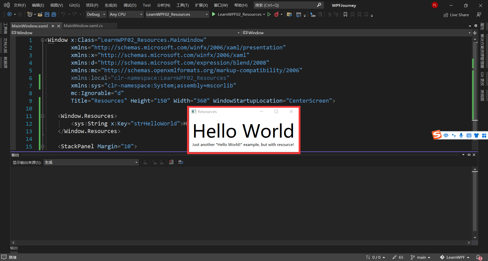
> 
> ☆：对应程序文件在`WPFJourney\LearnWPF02_Resources\MainWindow.xaml` 
> 
> ---
> 
> **共用一个简单字串**
> 
> ```xaml
> <Window x:Class="LearnWPF02_Resources.WindowResource1"
>   xmlns="http://schemas.microsoft.com/winfx/2006/xaml/presentation"
>   xmlns:x="http://schemas.microsoft.com/winfx/2006/xaml"
>   xmlns:d="http://schemas.microsoft.com/expression/blend/2008"
>   xmlns:mc="http://schemas.openxmlformats.org/markup-compatibility/2006"
>   xmlns:local="clr-namespace:LearnWPF02_Resources"
>   xmlns:sys="clr-namespace:System;assembly=mscorlib"
>   mc:Ignorable="d"
>   Title="WindowResource1" Height="160" Width="300" WindowStartupLocation="CenterScreen"
>   Background="{DynamicResource WindowBackgroundBrush}">
> 
> <Window.Resources>
>   <sys:String x:Key="ComboBoxTitle">Items:</sys:String>
> 
>   <x:Array x:Key="ComboBoxItems" Type="sys:String">
>       <sys:String>Item #1</sys:String>
>       <sys:String>Item #2</sys:String>
>       <sys:String>Item #3</sys:String>
>   </x:Array>
> 
>   <!-- 渐层笔刷 -->
>   <LinearGradientBrush x:Key="WindowBackgroundBrush">
>       <GradientStop Offset="0" Color="Silver"/>
>       <GradientStop Offset="1" Color="Gray"/>
>   </LinearGradientBrush>
> 
> </Window.Resources>
> 
> <StackPanel Margin="10">
>   <Label Content="{StaticResource ComboBoxTitle}"/>
>   <ComboBox ItemsSource="{StaticResource ComboBoxItems}"/>
> </StackPanel>
> </Window>
> ```
> 
> 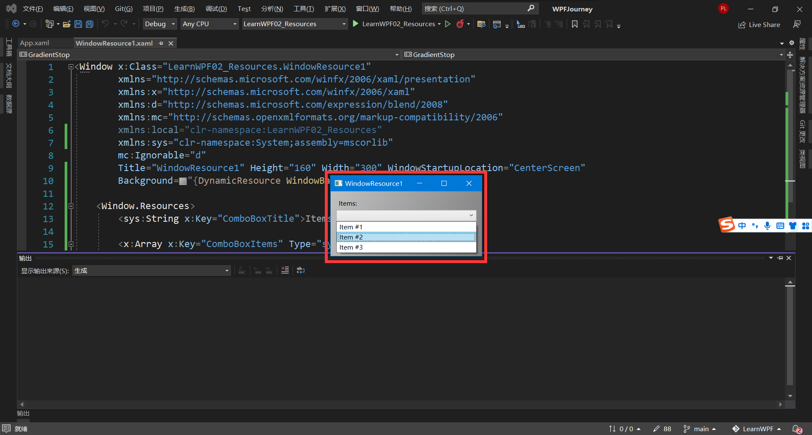
> 
> ☆：对应程序文件在`WPFJourney\LearnWPF02_Resources\WindowResource1.xaml` 
> 
> ---
> 
> **区域性范围资源**
> 
> ```xaml
> <StackPanel Margin="10">
> <StackPanel.Resources>
>   <sys:String x:Key="ComboBoxTitle">Items:</sys:String>
> </StackPanel.Resources>
> <Label Content="{StaticResource ComboBoxTitle}" />
> </StackPanel>
> ```
> 
> 上述代码在 `StackPanel` 中添加 `Resource` 并在 `StackPanel` 内调用，子项有权利调用。但是离开 `StackPanel` 的区域后无法使用该 `Resource`。
> 
> ---
> 
> **整个项目范围资源**
> 
> ```xaml
> ----------------- App.xaml --------------------------------
> <Application x:Class="LearnWPF02_Resources.App"
>        xmlns="http://schemas.microsoft.com/winfx/2006/xaml/presentation"
>        xmlns:x="http://schemas.microsoft.com/winfx/2006/xaml"
>        xmlns:local="clr-namespace:LearnWPF02_Resources"
>        xmlns:sys="clr-namespace:System;assembly=mscorlib"
>        StartupUri="WindowResource1.xaml">
> <Application.Resources>
>   <sys:String x:Key="ComboBoxTitle">Items:</sys:String>
> </Application.Resources>
> </Application>
> 
> ----------------- 任意WPF窗口文件 --------------------------------------
> <Label Content="{StaticResource ComboBoxTitle}"/>
> ```
> 
> 上述代码在项目的 `App.xaml` 文件中添加全局 `Resource`。就可以在该项目下任意窗口文件中调用该资源
> 
> ---
> 
> **后置程序码存取资源**
> 
> ```xaml
> <!-- App.xaml -->
> <Application x:Class="LearnWPF02_Resources.App"
>              xmlns="http://schemas.microsoft.com/winfx/2006/xaml/presentation"
>              xmlns:x="http://schemas.microsoft.com/winfx/2006/xaml"
>              xmlns:local="clr-namespace:LearnWPF02_Resources"
>              xmlns:sys="clr-namespace:System;assembly=mscorlib"
>              StartupUri="WindowResource1.xaml">
>     <Application.Resources>
>         <sys:String x:Key="ComboBoxTitle">Items:</sys:String>
> 
>         <sys:String x:Key="strApp">Hello App Resource!</sys:String>
> 
>     </Application.Resources>
> </Application>
> ```
> 
> ```xaml
> <!-- 窗口文件 -->
> <Window x:Class="LearnWPF02_Resources.WindowResource2"
>         xmlns="http://schemas.microsoft.com/winfx/2006/xaml/presentation"
>         xmlns:x="http://schemas.microsoft.com/winfx/2006/xaml"
>         xmlns:d="http://schemas.microsoft.com/expression/blend/2008"
>         xmlns:mc="http://schemas.openxmlformats.org/markup-compatibility/2006"
>         xmlns:local="clr-namespace:LearnWPF02_Resources"
>         xmlns:sys="clr-namespace:System;assembly=mscorlib"
>         mc:Ignorable="d"
>         Title="WindowResource2" Height="175" Width="300">
> 
>     <Window.Resources>
>         <sys:String x:Key="strWindow">Hello Window Resources</sys:String>
>     </Window.Resources>
> 
>     <DockPanel Margin="10" Name="pnlMain">
> 
>         <DockPanel.Resources>
>             <sys:String x:Key="strPanel">Hello, Panel world!</sys:String>
>         </DockPanel.Resources>
> 
>         <WrapPanel DockPanel.Dock="Top" HorizontalAlignment="Center" Margin="10">
>             <Button Name="btnClickMe" Click="btnClickMe_Click">Click me!</Button>
>         </WrapPanel>
> 
>         <ListBox Name="lbResult" />
>     </DockPanel>
> 
> </Window>
> ```
> 
> ```c#
> // C# 后台代码
> using System;
> using System.Windows;
> namespace WpfTutorialSamples.WPF_Application
> {
>     public partial class ResourcesFromCodeBehindSample : Window
>     {
>         public ResourcesFromCodeBehindSample()
>         {
>             InitializeComponent();
>         }
>         private void btnClickMe_Click(object sender, RoutedEventArgs e)
>         {
>             lbResult.Items.Add(pnlMain.FindResource("strPanel").ToString());
>             lbResult.Items.Add(this.FindResource("strWindow").ToString());
>             lbResult.Items.Add(Application.Current.FindResource("strApp").ToString());
>         }
>     }
> }
> ```
> 
> 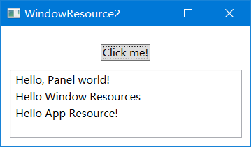
> 
> ☆：对应程序文件在`WPFJourney\LearnWPF02_Resources\App.xaml` 
> 
> ☆：对应程序文件在`WPFJourney\LearnWPF02_Resources\WindowResource2.xaml` 
> 
> ☆：对应程序文件在`WPFJourney\LearnWPF02_Resources\WindowResource2.xaml.cs` 

## 异常处理

> 与编程语言的异常处理方式相似，使用 `try-catch` 方式，对有可能出现异常的地方进行异常处理
> 
> 在 `WPF` 中有两种方式，一种是通过 `try-catch` 的局部异常处理，另一种是全局处理
> 
> ```xaml
> <!-- xaml文件 -->
> <Window x:Class="LearnWPF03_ExceptionSample.MainWindow"
>      xmlns="http://schemas.microsoft.com/winfx/2006/xaml/presentation"
>      xmlns:x="http://schemas.microsoft.com/winfx/2006/xaml"
>      xmlns:d="http://schemas.microsoft.com/expression/blend/2008"
>      xmlns:mc="http://schemas.openxmlformats.org/markup-compatibility/2006"
>      xmlns:local="clr-namespace:LearnWPF03_ExceptionSample"
>      mc:Ignorable="d"
>      Title="Exception" Height="200" Width="300">
>  <DockPanel>
>      <Button Margin="30" x:Name="Button1" Content="Button one" FontSize="24" Click="Button1_Click"/>
>  </DockPanel>
> </Window>
> ```
> 
> ```c#
> // 与上面 .xaml 文件对应的 .xaml.cs 文件下的核心代码
> private void Button1_Click(object sender, RoutedEventArgs e)
> {
>  string s = null;
>  try
>  {
>      s.Trim();
>  }
>  catch(Exception Exce)
>  {
>      MessageBox.Show("A handled exception just occurred: " 
>                         + Exce.Message, "Exception Sample", 
>                         MessageBoxButton.OK,
>                         MessageBoxImage.Warning);
>     }
> }
> ```
> 
> ☆：对应程序文件在`WPFJourney\LearnWPF03_ExceptionSample\MainWindow.xaml` 
> 
> ☆：对应程序文件在`WPFJourney\LearnWPF03_ExceptionSample\MainWindow.xaml.cs` 
> 
> ---
> 
> `「DispatcherUnhandledException」` 事件实现全域处理异常
> 
> ```xaml
> <!-- App.xaml -->
> <Application x:Class="LearnWPF03_ExceptionSample.App"
>              xmlns="http://schemas.microsoft.com/winfx/2006/xaml/presentation"
>              xmlns:x="http://schemas.microsoft.com/winfx/2006/xaml"
>              xmlns:local="clr-namespace:LearnWPF03_ExceptionSample"
>              DispatcherUnhandledException="Application_DispatcherUnhandledException"
>              StartupUri="Example1.xaml">
>     <Application.Resources>
> 
>     </Application.Resources>
> </Application>
> <!-- 在该文件中添加DispatcherUnhandleException事件 -->
> ```
> 
> ```c#
> // App.xaml.cs文件的核心代码，添加
> private void Application_DispatcherUnhandledException(object sender, System.Windows.Threading.DispatcherUnhandledExceptionEventArgs e)
> {
>     MessageBox.Show("An unhandled exception just occurred: " 
>                     + e.Exception.Message, 
>                     "Exception Sample", 
>                     MessageBoxButton.OK, 
>                     MessageBoxImage.Warning);
>     e.Handled = true;   // 告知 WPF 我们已处理完成此异常且没有其他相关事项需要完成
> }
> ```
> 
> ```xaml
> <!-- Example1.xaml文件 -->
> <Window x:Class="LearnWPF03_ExceptionSample.Example1"
>         xmlns="http://schemas.microsoft.com/winfx/2006/xaml/presentation"
>         xmlns:x="http://schemas.microsoft.com/winfx/2006/xaml"
>         xmlns:d="http://schemas.microsoft.com/expression/blend/2008"
>         xmlns:mc="http://schemas.openxmlformats.org/markup-compatibility/2006"
>         xmlns:local="clr-namespace:LearnWPF03_ExceptionSample"
>         mc:Ignorable="d"
>         Title="Example1" Height="200" Width="280"
>         WindowStartupLocation="CenterScreen">
>     <Grid>
>         <Button HorizontalAlignment="Center" VerticalAlignment="Center" Click="Button_Click" Content="Do something bad!" />
>     </Grid>
> </Window>
> ```
> 
> ```csharp
> // Example1.xaml.cs
> private void Button_Click(object sender, RoutedEventArgs e)
> {
>     string s = null;
>     try
>     {
>         s.Trim();
>     }
>     catch (Exception ex)
>     {
>         MessageBox.Show("A handled exception just occurred: "
>                         + ex.Message, "Exception Sample",
>                         MessageBoxButton.OK,
>                         MessageBoxImage.Warning);
>     }
>     s.Trim();//没有放在try里面处理，放在了App.xaml中进行全域处理
> }
> ```
> 
> ☆：对应程序文件在`WPFJourney\LearnWPF03_ExceptionSample\App.xaml` 
> 
> ☆：对应程序文件在`WPFJourney\LearnWPF03_ExceptionSample\App.xaml.cs` 
> 
> ☆：对应程序文件在`WPFJourney\LearnWPF03_ExceptionSample\Example1.xaml` 
> 
> ☆：对应程序文件在`WPFJourney\LearnWPF03_ExceptionSample\Example1.xaml.cs` 

## 应用程序国际化

> 无论应用程序是否需要做大做强，如果想要跨国让外国友人也能够友好的使用应用程序，那么就需要对应用程序进行国际化(区域性)处理。
> 
> `using System.Globalization` 
> 
> ```xaml
> <!-- 对App.xaml文件添加应用启动事件 -->
> Startup="Application_Startup"
> ```
> 
> ```c#
> // App.xaml.cs文件
> private void Application_Startup(object sender, StartupEventArgs e)
> {
>     Thread.CurrentThread.CurrentCulture = new CultureInfo("de-DE");
>     Thread.CurrentThread.CurrentUICulture = new CultureInfo("en-US");
> }
> ```
> 
> ```xaml
> <!-- 对MainWindow.xaml文件添加布局 -->
> <Window x:Class="LearnWPF04_InternationalizationSample.MainWindow"
>         xmlns="http://schemas.microsoft.com/winfx/2006/xaml/presentation"
>         xmlns:x="http://schemas.microsoft.com/winfx/2006/xaml"
>         xmlns:d="http://schemas.microsoft.com/expression/blend/2008"
>         xmlns:mc="http://schemas.openxmlformats.org/markup-compatibility/2006"
>         xmlns:local="clr-namespace:LearnWPF04_InternationalizationSample"
>         mc:Ignorable="d"
>         Title="MainWindow" Height="200" Width="320"
>         WindowStartupLocation="CenterScreen">
> 
>     <StackPanel Margin="10">
>         <Grid>
> 
>             <Grid.RowDefinitions>
>                 <RowDefinition Height="Auto"/>
>                 <RowDefinition Height="Auto"/>
>             </Grid.RowDefinitions>
> 
>             <Grid.ColumnDefinitions>
>                 <ColumnDefinition Width="*"/>
>                 <ColumnDefinition Width="*"/>
>             </Grid.ColumnDefinitions>
>             <Label>Number:</Label>
>             <Label Name="lblNumber" Grid.Column="1" />
>             <Label Grid.Row="1">Date:</Label>
>             <Label Name="lblDate" Grid.Row="1" Grid.Column="1" />
>         </Grid>
> 
>         <StackPanel Orientation="Horizontal" HorizontalAlignment="Center" Margin="0,20">
>             <Button Tag="en-US" Click="CultureInfoSwitchButton_Click" HorizontalContentAlignment="Stretch">English (US)</Button>
>             <Button Tag="de-DE" Click="CultureInfoSwitchButton_Click" HorizontalContentAlignment="Stretch" Margin="10,0">German (DE)</Button>
>             <Button Tag="sv-SE" Click="CultureInfoSwitchButton_Click" HorizontalContentAlignment="Stretch">Swedish (SE)</Button>
>         </StackPanel>
> 
>     </StackPanel>
> 
> </Window>
> ```
> 
> ```csharp
> // MainWindow.xaml.cs
> using System;
> using System.Windows;
> using System.Windows.Controls;
> 
> using System.Threading;
> using System.Globalization;
> 
> namespace LearnWPF04_InternationalizationSample
> {
>     /// <summary>
>     /// Interaction logic for MainWindow.xaml
>     /// </summary>
>     public partial class MainWindow : Window
>     {
>         public MainWindow()
>         {
>             InitializeComponent();
>         }
> 
>         private void CultureInfoSwitchButton_Click(object sender, RoutedEventArgs e)
>         {
>             Thread.CurrentThread.CurrentCulture = new CultureInfo((sender as Button).Tag.ToString());
>             lblNumber.Content = (123456789.42d).ToString("N2");
>             lblDate.Content = DateTime.Now.ToString();
>         }
>     }
> }
> ```
> 
> 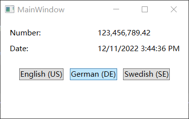
> 
> ☆：对应程序文件在`WPFJourney\LearnWPF04_InternationalizationSample\App.xaml` 
> 
> ☆：对应程序文件在`WPFJourney\LearnWPF04_InternationalizationSample\App.xaml.cs` 
> 
> ☆：对应程序文件在`WPFJourney\LearnWPF04_InternationalizationSample\MainWindow.xaml` 
> 
> ☆：对应程序文件在`WPFJourney\LearnWPF04_InternationalizationSample\MainWindow.xaml.cs` 

## WPF 控件

> 用于布局界面、显示内容、输入内容、按钮点击等效果
> 
> 可以按逻辑分组为多个类别
> 
> + `Layout`：布局控件用于管理子元素的大小、尺寸、位置和排列
> + `button`：按钮是最基本的用户界面控件之一，用于响应用户的点击
> + `数据显示`：用于显示来自数据源的信息
> + `日期显示和选项`：用于显示和选择日历信息
> + `菜单`：用于对关联的操作进行分组或提供上下文帮助
> + `选择`：用于使用户选择一个或多个选项
> + `导航`：通过创建目标框架或选项卡式的应用程序外观来增强或扩展应用程序导航体验
> + `对话`框：常见的用户交互方案（如打印）提供目标支持
> + `用户信息`：提供上下文反馈或阐明应用程序的用户界面。 用户通常无法与这些控件进行交互
> + `文档`：用于查看文档的专用控件
> + `输入`：可以使用户输入文本和其他内容
> + `媒体`：包括大多数常见图像格式的 [codecs]，而且还包括对承载音频和视频内容的集成支持
> + `数字墨迹`：提供对墨迹查看和墨迹输入等 Tablet PC 功能的集成支持
> + ……

### 基础控件

#### TextBlock

> `TextBlock` 不是控制项，因为它并没有继承控件类别，但它使用起来和 `WPF `中的其他控制项还是类似
> 
> 是 WPF 中基本的控件项，作用是显示文字在萤幕上
> 
> 多用于短、单行的文字
> 
> ---
> 
> **简单使用**
> 
> ```xaml
> <!-- Contraol01_TextBlock.xaml -->
> <Window x:Class="LearnWPF05_Control.Control01_TextBlock"
>      xmlns="http://schemas.microsoft.com/winfx/2006/xaml/presentation"
>      xmlns:x="http://schemas.microsoft.com/winfx/2006/xaml"
>      xmlns:d="http://schemas.microsoft.com/expression/blend/2008"
>      xmlns:mc="http://schemas.openxmlformats.org/markup-compatibility/2006"
>      xmlns:local="clr-namespace:LearnWPF05_Control"
>      mc:Ignorable="d"
>      Title="Control01_TextBlock" Height="100" Width="200"
>      WindowStartupLocation="CenterScreen">
>  <Grid>
>      <TextBlock>This is TextBlock control!</TextBlock>
>  </Grid>
> </Window>
> ```
> 
> ☆：对应程序文件在 `WPFJourney\LearnWPF05_Control\Contraol01_TextBlock.xaml` 
> 
> ---
> 
> **添加属性**
> 
> ```xaml
> <!-- 修改文件Contraol01_TextBlock.xaml -->
> <Window x:Class="LearnWPF05_Control.Control01_TextBlock"
>      xmlns="http://schemas.microsoft.com/winfx/2006/xaml/presentation"
>      xmlns:x="http://schemas.microsoft.com/winfx/2006/xaml"
>      xmlns:d="http://schemas.microsoft.com/expression/blend/2008"
>      xmlns:mc="http://schemas.openxmlformats.org/markup-compatibility/2006"
>      xmlns:local="clr-namespace:LearnWPF05_Control"
>      mc:Ignorable="d"
>      Title="Control01_TextBlock" Height="100" Width="200"
>      WindowStartupLocation="CenterScreen">
>  <Grid>
> 
>      <TextBlock Margin="10">
>          This is TextBlock control!
>      </TextBlock>
> 
>  </Grid>
> </Window>
> ```
> 
> ☆：对应程序文件在 `WPFJourney\LearnWPF05_Control\Contraol01_TextBlock.xaml` 
> 
> ---
> 
> **长字串处理**
> 
> ```xaml
> <!-- 修改文件Contraol01_TextBlock.xaml -->
> <Window x:Class="LearnWPF05_Control.Control01_TextBlock"
>      xmlns="http://schemas.microsoft.com/winfx/2006/xaml/presentation"
>      xmlns:x="http://schemas.microsoft.com/winfx/2006/xaml"
>      xmlns:d="http://schemas.microsoft.com/expression/blend/2008"
>      xmlns:mc="http://schemas.openxmlformats.org/markup-compatibility/2006"
>      xmlns:local="clr-namespace:LearnWPF05_Control"
>      mc:Ignorable="d"
>      Title="Control01_TextBlock" Height="200" Width="250"
>      WindowStartupLocation="CenterScreen">
>  <!--<Grid>-->
>      <!--<TextBlock>This is TextBlock control!</TextBlock>-->
>      <!--<TextBlock Margin="10">This is TextBlock control!</TextBlock>-->
>  <!--</Grid>-->
> 
>  <StackPanel>
> 
>      <TextBlock Margin="10" Foreground="Red">
>          This is a TextBlock control <LineBreak />
>          with multiple lines of text.
>      </TextBlock>
> 
>      <TextBlock Margin="10" Foreground="Green" TextTrimming="CharacterEllipsis">
>          This is a TextBlock control with text that may not be rendered completely, 
>          which will be indicated with an ellipsis.
>      </TextBlock>
> 
>      <TextBlock Margin="10" TextWrapping="Wrap" Foreground="Blue">
>          This is a TextBlock control with automatically wrapped text, 
>          using the TextWrapping property.
>      </TextBlock>
> 
>  </StackPanel>
> </Window>
> 
> <!-- LineBreak标签用于换行(手动) -->
> <!-- Foreground属性用于修改文字前景色 -->
> 
> <!-- 
>     TextTrimming属性 当单行文本框内容存不下字符时采取的对策
>         WordEllipsis：空间不足的时候，以最后一个单字为单位显示后跟省略号
>         CharacterEllipsis：让TextBlock在没有足够空间的时候显示省略号
> -->
> 
> <!-- 
>     TextWrapping属性 当多行文本框内容存不下字符时采取的对策
>         Wrap：让TextBlock在没有足够空间显示时自动换行
> -->
> ```
> 
> ☆：对应程序文件在 `WPFJourney\LearnWPF05_Control\Contraol01_TextBlock.xaml` 
> 
> ---
> 
> **粗体、斜体和下划线**
> 
> ```xaml
> <Window x:Class="LearnWPF05_Control.Control01_TextBlock"
>         xmlns="http://schemas.microsoft.com/winfx/2006/xaml/presentation"
>         xmlns:x="http://schemas.microsoft.com/winfx/2006/xaml"
>         xmlns:d="http://schemas.microsoft.com/expression/blend/2008"
>         xmlns:mc="http://schemas.openxmlformats.org/markup-compatibility/2006"
>         xmlns:local="clr-namespace:LearnWPF05_Control"
>         mc:Ignorable="d"
>         Title="Control01_TextBlock" Height="200" Width="250"
>         WindowStartupLocation="CenterScreen">
>     <Grid>
>         <TextBlock Margin="10" TextWrapping="Wrap">
>             TextBlock with <Bold>blod</Bold>, 
>             <Italic>italic</Italic> and <Underline>underline</Underline> text.
>         </TextBlock>
>     </Grid>
> 
> </Window>
> <!-- Bold：加粗 -->
> <!-- Italic：斜体 -->
> <!-- Underline：下划线 -->
> ```
> 
> ☆：对应程序文件在 `WPFJourney\LearnWPF05_Control\Contraol01_TextBlock.xaml` 
> 
> ---
> 
> **超链接**
> 
> 超链接(`Hyperlink`)元素允许在文本中包含链接。 它使用适合当前Windows主题的样式进行渲染，该主题通常是带下引线的蓝色文本，并带有滑鼠的手形指标和红色悬停效果。 可以使用NavigateUri属性来定义要导航的URL。
> 
> 也可以使用 WPF 内部连结来实现 page 之间的切换
> 
> ```xaml
> <Window x:Class="LearnWPF05_Control.Control01_TextBlock"
>         xmlns="http://schemas.microsoft.com/winfx/2006/xaml/presentation"
>         xmlns:x="http://schemas.microsoft.com/winfx/2006/xaml"
>         xmlns:d="http://schemas.microsoft.com/expression/blend/2008"
>         xmlns:mc="http://schemas.openxmlformats.org/markup-compatibility/2006"
>         xmlns:local="clr-namespace:LearnWPF05_Control"
>         mc:Ignorable="d"
>         Title="Control01_TextBlock" Height="200" Width="250"
>         WindowStartupLocation="CenterScreen">
> 
>     <TextBlock Margin="10" TextWrapping="Wrap">
>         This text has 
>         <Hyperlink RequestNavigate="Hyperlink_RequestNavigate" NavigateUri="https://www.baidu.com">
>             link
>         </Hyperlink> 
>         in it.
>     </TextBlock>
> 
> </Window>
> ```
> 
> ☆：对应程序文件在 `WPFJourney\LearnWPF05_Control\Contraol01_TextBlock.xaml`
> 
> ---
> 
> **Run**
> 
> Run元素允许使用所有可以在Span元素中使用的属性来定义文本的样式。但相对于Span可以包含其他行内元素，Run只能包含纯文本。比较起来很显然Span元素更灵活而且在绝大多数情况上都是一个更合理的选择
> 
> ---
> 
> **Span**
> 
> Span元素本身并没有任何默认的显示效果，但允许设置几乎所有的显示效果，包括字体大小、字体样式和粗细，以及背景和前景颜色等等。Span元素最伟大的地方在于它能包含其他行内元素在其中，使得构建更为复杂的文本以及样式非常容易
> 
> ```xaml
> <Window x:Class="LearnWPF05_Control.Control01_TextBlock"
>         xmlns="http://schemas.microsoft.com/winfx/2006/xaml/presentation"
>         xmlns:x="http://schemas.microsoft.com/winfx/2006/xaml"
>         xmlns:d="http://schemas.microsoft.com/expression/blend/2008"
>         xmlns:mc="http://schemas.openxmlformats.org/markup-compatibility/2006"
>         xmlns:local="clr-namespace:LearnWPF05_Control"
>         mc:Ignorable="d"
>         Title="Control01_TextBlock" Height="200" Width="250"
>         WindowStartupLocation="CenterScreen">
> 
>     <Grid>
>         <TextBlock Margin="10" TextWrapping="Wrap">
>             This <Span FontWeight="Bold">is</Span> a
>             <Span Background="Silver" Foreground="Maroon">TextBlock</Span>
>             with <Span TextDecorations="Underline">several</Span>
>             <Span FontStyle="Italic">Span</Span> elements,
>             <Span Foreground="Blue">
>                 using a <Bold>variety</Bold> of <Italic>styles</Italic>
>             </Span>.
>         </TextBlock>
>     </Grid>
> 
> </Window>
> ```
> 
> ☆：对应程序文件在 `WPFJourney\LearnWPF05_Control\Contraol01_TextBlock.xaml`

#### Label

> `Label` 控件在最简单的形式下和 `TextBlock` 看起来非常像。但 `Label` 使用的是 `Content` 属性而不是 `Text` 属性。这是因为`Label` 内部可以放置任意类型的控件而不仅仅是文本。当然这个内容也可以是一个字符串
> 
> ---
> 
> **简单使用**
> 
> ```xaml
> <!-- .\LearnWPF\WPFJourney\LearnWPF05_Control\Control02_Label -->
> <Window x:Class="LearnWPF05_Control.Control02_Label"
>         xmlns="http://schemas.microsoft.com/winfx/2006/xaml/presentation"
>         xmlns:x="http://schemas.microsoft.com/winfx/2006/xaml"
>         xmlns:d="http://schemas.microsoft.com/expression/blend/2008"
>         xmlns:mc="http://schemas.openxmlformats.org/markup-compatibility/2006"
>         xmlns:local="clr-namespace:LearnWPF05_Control"
>         mc:Ignorable="d"
>         Title="Control02_Label" Height="100" Width="200">
>     <Grid>
>         <Label Content="This is Label control."/>
>     </Grid>
> </Window>
> ```
> 
> ☆：Label 在预设中会有一点 padding
> 
> ☆：Label实际上会在内部创建一个 `TextBlock` 并在其中显示您的string
> 
> ---
> 
> **`Label` 与 `TextBlock` 的对比**
> 
> `TextBlock` 仅允许呈现文本字串，而 `Label` 还允许做下列的事情：
> 
> - 设定边界(border)
> - 渲染其他控件，例如一张图片等
> - 通过 `ContentTemplate` 属性使用模板化的内容
> - 使用访问键聚焦到相关的控件上
> 
> ☆：当只需要渲染简单的文本内容时，应该使用 `TextBlock` ，因为它更轻量并且在大多数场景下性能比Label好
> 
> ---
> 
> **Label和访问键(助记符)**
> 
> 在 Windows 和其他系统，这是常见的做法：以按下 [Alt] 然后按下想要访问的控制项字元，来访问 `dailog ` 中的控制项。当按住 [Alt] 时，字元会被高亮显示。`TextBlock ` 没有提供这个功能，但 `Label ` 有。所以对于控制标籤， `Label  `控制项常常是很好的选择。案例如下
> 
> ```xaml
> <!-- .\LearnWPF\WPFJourney\LearnWPF05_Control\Control02_Label.xaml -->
> <Window x:Class="LearnWPF05_Control.Control02_Label"
>         xmlns="http://schemas.microsoft.com/winfx/2006/xaml/presentation"
>         xmlns:x="http://schemas.microsoft.com/winfx/2006/xaml"
>         xmlns:d="http://schemas.microsoft.com/expression/blend/2008"
>         xmlns:mc="http://schemas.openxmlformats.org/markup-compatibility/2006"
>         xmlns:local="clr-namespace:LearnWPF05_Control"
>         mc:Ignorable="d"
>         Title="Control02_Label" Height="200" Width="200"
>         WindowStartupLocation="CenterScreen">
> 
>     <StackPanel Margin="10">
> 
>         <Label Content="_Name:" Target="{Binding ElementName=txtName}" />
> 
>         <TextBox Name="txtName" />
> 
>         <Label Content="_Mail:" Target="{Binding ElementName=txtMail}"/>
> 
>         <TextBox Name="txtMail"/>
> 
>     </StackPanel>
> 
> </Window>
> ```
> 
> 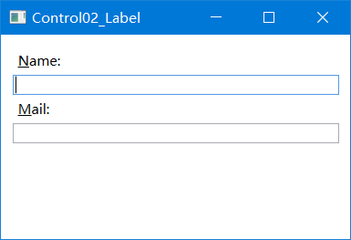
> 
> 按下Alt键时会显示如截图所示示例对话框。运行它，按住[Alt]键，然后按N和M，将看到两个文本框之间的焦点移动方式
> 
> 新知识(后续会补充):
> 
> + 通过在字符前放置下划线（_）来定义访问键.它不必是第一个字符，它可以在标签内容中的任何字符之前。通常的做法是使用尚未用作另一个控件的访问键的第一个字符
> + 使用 `Target` 属性来连接 `Label` 和指定的控件。这里使用一个标准的 `WPF` 绑定，使用 `ElementName` 属性，将在后面描述所有这些内容。绑定是基于控件的名称，因此，如果更改此名称，还必须记住更改绑定
> 
> ---
> 
> 在Label控件中使用控件
> 
> ```xaml
> <!-- .\LearnWPF\WPFJourney\LearnWPF05_Control\Control02_Label.xaml -->
> <Window x:Class="LearnWPF05_Control.Control02_Label"
>         xmlns="http://schemas.microsoft.com/winfx/2006/xaml/presentation"
>         xmlns:x="http://schemas.microsoft.com/winfx/2006/xaml"
>         xmlns:d="http://schemas.microsoft.com/expression/blend/2008"
>         xmlns:mc="http://schemas.openxmlformats.org/markup-compatibility/2006"
>         xmlns:local="clr-namespace:LearnWPF05_Control"
>         mc:Ignorable="d"
>         Title="Control02_Label" Height="200" Width="200"
>         WindowStartupLocation="CenterScreen">
> 
>     <StackPanel Margin="10">
> 
>         <Label Target="{Binding ElementName=txtName}" >
>             <StackPanel Orientation="Horizontal">
>                 <Image Source="http://cdn1.iconfinder.com/data/icons/fatcow/16/bullet_green.png"/>
>                 <AccessText Text="_Name:"/>
>             </StackPanel>
>         </Label>
>         <TextBox Name="txtName" />
> 
>         <Label Target="{Binding ElementName=txtMail}" >
>             <StackPanel Orientation="Horizontal">
>                 <Image Source="http://cdn1.iconfinder.com/data/icons/fatcow/16/bullet_blue.png"/>
>                 <AccessText Text="_Mail:"/>
>             </StackPanel>
>         </Label>
>         <TextBox Name="txtMail"/>
> 
>     </StackPanel>
> 
> </Window>
> ```
> 
> `Label` 现在将同时托管图像和文本（在 `AccessText` 控件中，它允许使用标签的访问键）。这两个控件都在水平 `StackPanel` 中，因为 `Label`，就像任何其他 `ContentControl` 派生控件一样，只能托管一个直接子控件。
> 
> ---
> 
> ☆：大多数情况下，`Label` 控件完全按照名称所示：它充当另一控件的文本标签

#### TextBox

> TextBox控件是WPF中最基本的文字输入控件。
> 
> 它允许最终用户在一行、对话输入、或多行编写，就像是个编辑器
> 
> 不使用任何属性，就能有一个完整并可编辑的文本字段
> 
> 在文本框里鼠标右击，会得到一个选项菜单
> 
> 允许和Windows剪贴板一块使用这个TextBox
> 
> 默认的撤销和重做的键盘快捷方式(Ctrl + Z 和 Ctrl + Y)也是起作用
> 
> ---
> 
> <u>单行文本框</u>
> 
> ```xaml
> <!-- .\LearnWPF\WPFJourney\LearnWPF05_Control\Control03_TextBox -->
> <Window x:Class="LearnWPF05_Control.Control03_TextBox"
>         xmlns="http://schemas.microsoft.com/winfx/2006/xaml/presentation"
>         xmlns:x="http://schemas.microsoft.com/winfx/2006/xaml"
>         xmlns:d="http://schemas.microsoft.com/expression/blend/2008"
>         xmlns:mc="http://schemas.openxmlformats.org/markup-compatibility/2006"
>         xmlns:local="clr-namespace:LearnWPF05_Control"
>         mc:Ignorable="d"
>         Title="Control03_TextBox" Height="80" Width="250">
> 
>     <StackPanel Margin="10">
>         <TextBox Text="Hello World!" />
>     </StackPanel>
> </Window>
> <!-- 该窗口是显示一个单行的编辑框 -->
> ```
> 
> ☆：所有这些功能能够不受限制的使用
> 
> ---
> 
> <u>多行文本框</u>
> 
> ```xaml
> <!-- .\LearnWPF\WPFJourney\LearnWPF05_Control\Control03_TextBox -->
> <Window x:Class="LearnWPF05_Control.Control03_TextBox"
>         xmlns="http://schemas.microsoft.com/winfx/2006/xaml/presentation"
>         xmlns:x="http://schemas.microsoft.com/winfx/2006/xaml"
>         xmlns:d="http://schemas.microsoft.com/expression/blend/2008"
>         xmlns:mc="http://schemas.openxmlformats.org/markup-compatibility/2006"
>         xmlns:local="clr-namespace:LearnWPF05_Control"
>         mc:Ignorable="d"
>         Title="Control03_TextBox" Height="160" Width="280">
> 
>     <!--<StackPanel Margin="10">
>         <TextBox Text="Hello World!" />
>     </StackPanel>-->
> 
>     <Grid Margin="10">
>         <TextBox AcceptsReturn="True" TextWrapping="Wrap"/>
>     </Grid>
> 
> </Window>
> ```
> 
> ☆：AcceptsReturn属性使得TextBox变成一个多行控件，允许使用 回车/返回键进入到下一行
> 
> ☆：TextWrapping属性，当内容到达一行的尾部时，它会使文本能够自动被包裹起来
> 
> ---
> 
> <u>拼写检查</u>
> 
> TextBox控件实际上带有英语和其他几种语言（as of writing、英语、法语、德语和西班牙语）的自动拼写检查
> 
> ```xaml
> <!-- .\LearnWPF\WPFJourney\LearnWPF05_Control\Control03_TextBox -->
> <Window x:Class="LearnWPF05_Control.Control03_TextBox"
>         xmlns="http://schemas.microsoft.com/winfx/2006/xaml/presentation"
>         xmlns:x="http://schemas.microsoft.com/winfx/2006/xaml"
>         xmlns:d="http://schemas.microsoft.com/expression/blend/2008"
>         xmlns:mc="http://schemas.openxmlformats.org/markup-compatibility/2006"
>         xmlns:local="clr-namespace:LearnWPF05_Control"
>         mc:Ignorable="d"
>         Title="Control03_TextBox" Height="160" Width="280">
> 
>     <Grid Margin="10">
>         <TextBox AcceptsReturn="True" TextWrapping="Wrap" SpellCheck.IsEnabled="True" Language="en-US" />
>     </Grid>
> 
> </Window>
> ```
> 
> ☆：SpellCheck类中名为IsEnabled的附加属性，该属性仅支持对父控件进行拼写检查
> 
> ☆：Language属性，该属性指示拼写检查器使用的语言
> 
> ---
> 
> <u>选择属性</u>
> 
> `TextBox` 允许选择文本，例如一次删除整个单词或将文本的一部分复制到剪贴板。WPF文本框具有用于处理选定文本的多个属性，所有这些属性都可以读取或修改
> 
> ```xaml
> <!-- .\LearnWPF\WPFJourney\Control03_TextBox -->
> <Window x:Class="LearnWPF05_Control.Control03_TextBox"
>         xmlns="http://schemas.microsoft.com/winfx/2006/xaml/presentation"
>         xmlns:x="http://schemas.microsoft.com/winfx/2006/xaml"
>         xmlns:d="http://schemas.microsoft.com/expression/blend/2008"
>         xmlns:mc="http://schemas.openxmlformats.org/markup-compatibility/2006"
>         xmlns:local="clr-namespace:LearnWPF05_Control"
>         mc:Ignorable="d"
>         Title="Control03_TextBox" Height="160" Width="280">
> 
>     <DockPanel Margin="10">
>         <TextBox SelectionChanged="TextBox_SelectionChanged" DockPanel.Dock="Top"/>
>         <TextBox Name="txtStatus" AcceptsReturn="True" TextWrapping="Wrap" IsReadOnly="True" />
>     </DockPanel>
> </Window>
> ```
> 
> ```cs
> // .\LearnWPF\WPFJourney\Control03_TextBox.xaml.cs
> private void TextBox_SelectionChanged(object sender, RoutedEventArgs e)
> {
>         TextBox textBox = sender as TextBox;
>         txtStatus.Text = "Selection starts at character #" + textBox.SelectionStart + Environment.NewLine;
>         txtStatus.Text += "Selection is " + textBox.SelectionLength + " character(s) long" + Environment.NewLine;
>         txtStatus.Text += "Selected text: '" + textBox.SelectedText + "'";
> }
> ```
> 
> 
> 
> ☆：`SelectionStart` 它给出了当前光标位置或是否有选择：它从什么位置开始
> 
> ☆：`SelectionLength` 它给出了当前选择的长度，如果有的话。 否则它将返回0
> 
> ☆：`SelectedText` 如果有选择，它会给我们当前选择的字符串。 否则返回一个空字符串
> 
> ☆：所有这些属性都是可读的和可写的，这意味着可以修改它们。例如可以设置`SelectionStart` 和 `SelectionLength` 属性以选择自定义文本范围，或者可以使用 `SelectedText` 属性插入和选择字符串。文本框必须具有焦点，例如首先调用 `Focus()` 方法，以便工作

#### Button

> 按钮控件
> 
> ---
> 
> <u>简单的按钮</u>
> 
> ```xaml
> <Button Click="Button1_HelloWorld">Hello World</Button>
> <!-- 订阅click事件 -->
> ```
> 
> ```cs
> private void Button1_HelloWorld(object sender, RoutedEventArgs e)
> {
>     MessageBox.Show("Hello World!");
> }
> // 添加方法处理click事件
> ```
> 
> ---
> 
> <u>格式化内容</u>
> 
> 控件内部，`Button` 控件的 `Content` 文字内容会被转换为 `TextBlock` 控件，也就是说可以按照 `TextBlock` 的方式控制 `Button` 控件文字的样式。在 `Button` 控件中，会找到几个这样的特性，包括（但不限于）`Foreground`, `Background`, `FontWeight` 等等。换一种说法，改变 Button 控件文本格式是非常简单的
> 
> ```xaml
> <Button Background="Beige" Foreground="Blue" FontWeight="Bold">Formatted Button</Button>
> ```
> 
> ---
> 
> <u>具有高级内容</u>
> 
> 关于 `WPF` 的一个非常酷的事情是能够用其他 `WPF` 控件替换控件中的简单文本。 这也意味着不必将按钮限制为简单文本，格式相同 - 可以添加多个具有不同格式的文本控件。 `WPF Button` 仅支持一个直接子控件，但可以将其设置为 `Panel`，然后将根据需要放入任意数量的控件。 可以使用它来创建具有各种格式的按钮
> 
> ```xaml
> <Button>
>     <StackPanel Orientation="Horizontal">
>     <TextBlock>Formatted </TextBlock>
>     <TextBlock Foreground="Blue" FontWeight="Bold" Margin="2,0">Button</TextBlock>
>     <TextBlock Foreground="Gray" FontStyle="Italic">[Various]</TextBlock>
>     </StackPanel>
> </Button>
> ```
> 
> ☆：不仅仅局限于文字 - 可以把任何想要的东西放在的按钮里面
> 
> ---
> 
> <u>带图片</u>
> 
> ```xaml
> <Button Padding="5">  
>     <StackPanel Orientation="Horizontal">  
>     <Image Source="./Images/help.png" />  
>     <TextBlock Margin="5,0">Help</TextBlock>  
>     </StackPanel>  
> </Button>
> ```
> 
> ☆：添加Image
> 
> ---
> 
> <u>按钮填充</u> 
> 
> `WPF` 框架中的按钮默认情况下没有任何填充。 这意味着文本非常接近边框，这可能看起来有点奇怪，因为在其他地方找到的大多数按钮（web，其他应用程序等）确实在侧面至少有一些填充。 但不用担心，因为Button带有 `Padding` 属性
> 
> ```xaml
> <Button Padding="5,2">Hello, World!</Button>
> <!-- 这将在边上应用5像素的填充，在顶部和底部应用2个像素 -->
> ```
> 
> 可以使用样式在整个应用程序或整个应用程序中全局应用填充
> 
> ```xaml
> <Window.Resources>
>     <Style TargetType="{x:Type Button}">
>         <Setter Property="Padding" Value="5,2" />
>         <Setter Property="Margin" Value="5" />
>     </Style>
> </Window.Resources>
> ```
> 
> 

#### CheckBox

> CheckBox 控件允许用户启用或禁用一个选项，这通常在逻辑代码中对应一个布尔值
> 
> ```xaml
> <!-- ./WPFJourney/LearnWPF05_Control/Control05_CheckBox.xaml ->
> <Window x:Class="LearnWPF05_Control.Control05_CheckBox"
>         xmlns="http://schemas.microsoft.com/winfx/2006/xaml/presentation"
>         xmlns:x="http://schemas.microsoft.com/winfx/2006/xaml"
>         xmlns:d="http://schemas.microsoft.com/expression/blend/2008"
>         xmlns:mc="http://schemas.openxmlformats.org/markup-compatibility/2006"
>         xmlns:local="clr-namespace:LearnWPF05_Control"
>         mc:Ignorable="d"
>         Title="Control05_CheckBox" Height="140" Width="250"
>         WindowStartupLocation="CenterScreen">
> 
>     <StackPanel Margin="10">
>         <Label FontWeight="Bold">Application Options</Label>
>         <CheckBox>Enable feature ABC</CheckBox>
>         <CheckBox IsChecked="True">Enable feature XYZ</CheckBox>
>         <CheckBox>Enable feature WWW</CheckBox>
>     </StackPanel>
> 
> </Window>
> ```
> 
> ☆： `IsChecked` 属性：设置为True则默认勾选。使用 CheckBox 不需要其他的属性。如果想检查一个 CheckBox 是否被选中，也应在逻辑代码中检查 IsChecked 属性。
> 
> ---
> 
> <u>自定义内容</u>
> 
> `CheckBox `控件继承自 `ContentControl` 类，这意味着它可以接受自定义内容并把它显示在旁边。如果像上面的例子中一样，指定了一些文本，WPF 就会把它放入一个 TextBlock 控件并显示出来。这比手工创建 TextBlock 控件要方便
> 
> ```xaml
> <Window x:Class="LearnWPF05_Control.Control05_CheckBox"
>         xmlns="http://schemas.microsoft.com/winfx/2006/xaml/presentation"
>         xmlns:x="http://schemas.microsoft.com/winfx/2006/xaml"
>         xmlns:d="http://schemas.microsoft.com/expression/blend/2008"
>         xmlns:mc="http://schemas.openxmlformats.org/markup-compatibility/2006"
>         xmlns:local="clr-namespace:LearnWPF05_Control"
>         mc:Ignorable="d"
>         Title="Control05_CheckBox" Height="140" Width="250"
>         WindowStartupLocation="CenterScreen">
> 
>     <StackPanel Margin="10">
>         <Label FontWeight="Bold">Application Options</Label>
>         <CheckBox>
>             <TextBlock>
>                 Enable feature <Run Foreground="Green" FontWeight="Bold">ABC</Run>
>             </TextBlock>
>         </CheckBox>
>         <CheckBox IsChecked="True">
>             <WrapPanel>
>                 <TextBlock>
>                     Enable feature <Run FontWeight="Bold">XYZ</Run>
>                 </TextBlock>
>             </WrapPanel>
>         </CheckBox>
>         <CheckBox>
>             <TextBlock>
>                 Enable feature <Run Foreground="Blue" TextDecorations="Underline" FontWeight="Bold">WWW</Run>
>             </TextBlock>
>         </CheckBox>
>     </StackPanel>
> 
> </Window>
> ```
> 
> ☆：在内容中想放什么都可以。三个 CheckBox 里每一个的文本格式都不一样，我甚至在第二个里放了一个 Image 控件。如果我们用控件而非文本作为 CheckBox 内容，我们就能随意控制样式。更酷的是，无论你击内容的哪一部分，都可以开关 CheckBox 本身。
> 
> ---
> 
> <u>IsThreeState属性</u>
> 
> CheckBox 通常对应一个布尔值，也就是说它只有两种状态—— `真与假`，即启用与禁用。然而，布尔值也可以是空值，这就带来了第三种状态（真，假或空）。CheckBox 也支持第三种状态。如果把 IsThreeState 属性设为真，CheckBox 就会拥有第三种状态，被称作“不定态”
> 
> ```xaml
> <!-- ./WPFJourney/LearnWPF05_Control/Control05_CheckBox.xaml ->
> <Window x:Class="LearnWPF05_Control.Control05_CheckBox"
>         xmlns="http://schemas.microsoft.com/winfx/2006/xaml/presentation"
>         xmlns:x="http://schemas.microsoft.com/winfx/2006/xaml"
>         xmlns:d="http://schemas.microsoft.com/expression/blend/2008"
>         xmlns:mc="http://schemas.openxmlformats.org/markup-compatibility/2006"
>         xmlns:local="clr-namespace:LearnWPF05_Control"
>         mc:Ignorable="d"
>         Title="Control05_CheckBox" Height="180" Width="250"
>         WindowStartupLocation="CenterScreen">
> 
>     <StackPanel Margin="10">
>         <Label FontWeight="Bold">Application Options</Label>
>         <StackPanel Margin="10,5">
>             <CheckBox IsThreeState="True" Name="cbAllFeatures" Checked="cbAllFeatures_CheckedChanged" Unchecked="cbAllFeatures_CheckedChanged">Enable all</CheckBox>
>             <StackPanel Margin="20,5">
>                 <CheckBox Name="cbFeatureAbc" Checked="cbFeature_CheckedChanged" Unchecked="cbFeature_CheckedChanged">Enable feature ABC</CheckBox>
>                 <CheckBox Name="cbFeatureXyz" IsChecked="True" Checked="cbFeature_CheckedChanged" Unchecked="cbFeature_CheckedChanged">Enable feature XYZ</CheckBox>
>                 <CheckBox Name="cbFeatureWww" Checked="cbFeature_CheckedChanged" Unchecked="cbFeature_CheckedChanged">Enable feature WWW</CheckBox>
>             </StackPanel>
>         </StackPanel>
>     </StackPanel>
> 
> </Window>
> ```
> 
> ```cs
> // ./WPFJourney/LearnWPF05_Control/Control05_CheckBox.xaml.cs ->
> private void cbAllFeatures_CheckedChanged(object sender, RoutedEventArgs e)
> {
>         bool newVal = (cbAllFeatures.IsChecked == true);
>         cbFeatureAbc.IsChecked = newVal;
>         cbFeatureXyz.IsChecked = newVal;
>         cbFeatureWww.IsChecked = newVal;
> }
> 
> private void cbFeature_CheckedChanged(object sender, RoutedEventArgs e)
> {
>         cbAllFeatures.IsChecked = null;
>         if ((cbFeatureAbc.IsChecked == true) 
>             && (cbFeatureXyz.IsChecked == true) 
>             && (cbFeatureWww.IsChecked == true))
>             cbAllFeatures.IsChecked = true;
> 
>         if ((cbFeatureAbc.IsChecked == false) 
>             && (cbFeatureXyz.IsChecked == false) 
>             && (cbFeatureWww.IsChecked == false))
>             cbAllFeatures.IsChecked = false;
> }
> ```
> 
> 
> 
> ☆：这个例子有两个角度：如果勾选或取消“全部启用”的 CheckBox，则那些代表一个个功能的子 CheckBox 也会一起被勾选或取消。反过来看也成立：单独操作子 CheckBox 也会影响“全部启用” CheckBox 的状态。如果子 CheckBox 全部被勾选或取消，“全部启用” CheckBox 就会获得对应的状态。但要是子 CheckBox 的状态不统一，“全部启用” CheckBox 的值就会为空值，令它进入不定态
> 
> ☆：通过订阅 CheckBox 控件的 Checked 和 Unchecked 事件来实现

#### RadioButton

> 控件允许向用户提供一列可能的选项，且同时只允许选中一个。可以用 `Combobox `来占用更少的空间实现同样的效果，但一组单选框会令用户更直观地看到他们的可用选项
> 
> ```xaml
> <!-- ./WPFJourney/LearnWPF05_Control/Control06_RadioButton.xaml -->
> <Window x:Class="LearnWPF05_Control.Control06_RadioButton"
>         xmlns="http://schemas.microsoft.com/winfx/2006/xaml/presentation"
>         xmlns:x="http://schemas.microsoft.com/winfx/2006/xaml"
>         xmlns:d="http://schemas.microsoft.com/expression/blend/2008"
>         xmlns:mc="http://schemas.openxmlformats.org/markup-compatibility/2006"
>         xmlns:local="clr-namespace:LearnWPF05_Control"
>         mc:Ignorable="d"
>         Title="Control06_RadioButton" Height="150" Width="250"
>         WindowStartupLocation="CenterScreen">
> 
>     <StackPanel Margin="10">
>         <Label FontWeight="Bold">Are you ready?</Label>
>         <RadioButton>Yes</RadioButton>
>         <RadioButton>No</RadioButton>
>         <RadioButton IsChecked="True">Maybe</RadioButton>
>     </StackPanel>
> </Window>
> ```
> 
> `IsChecked` 属性来定义默认选项。要从逻辑代码检查 RadioButton 是否被选中，也应检查这个属性。
> 
> ---
> 
> <u>RadioButton组</u>
> 
> 如果需要多组 RadioButton，每一组都能有它们自己的选择，这时就要用到 `GroupName` 属性，允许指定 RadioButton 的分组
> 
> ```Xaml
> <!-- ./WPFJourney/LearnWPF05_Control/Control06_RadioButton.xaml -->
> <Window x:Class="LearnWPF05_Control.Control06_RadioButton"
>         xmlns="http://schemas.microsoft.com/winfx/2006/xaml/presentation"
>         xmlns:x="http://schemas.microsoft.com/winfx/2006/xaml"
>         xmlns:d="http://schemas.microsoft.com/expression/blend/2008"
>         xmlns:mc="http://schemas.openxmlformats.org/markup-compatibility/2006"
>         xmlns:local="clr-namespace:LearnWPF05_Control"
>         mc:Ignorable="d"
>         Title="Control06_RadioButton" Height="230" Width="250"
>         WindowStartupLocation="CenterScreen">
> 
>     <StackPanel Margin="10">
>         <Label FontWeight="Bold">Are you ready?</Label>
>         <RadioButton GroupName="ready">Yes</RadioButton>
>         <RadioButton GroupName="ready">No</RadioButton>
>         <RadioButton GroupName="ready" IsChecked="True">Maybe</RadioButton>
> 
>         <Label FontWeight="Bold">Male or female?</Label>
>         <RadioButton GroupName="sex">Male</RadioButton>
>         <RadioButton GroupName="sex">Female</RadioButton>
>         <RadioButton GroupName="sex" IsChecked="True">Not sure</RadioButton>
>     </StackPanel>
> 
> </Window>
> ```
> 
> ☆：设定了 GroupName 属性以后，两组单选框里都可以各有一个选择了。如果没有这个属性，六个单选框里只能有一个选择
> 
> ---
> 
> <u>自定义内容</u>
> 
> RadioButton 继承自 ContentControl 类，这意味着它可以接受自定义内容并把它显示在旁边。像在上面的例子中一样，指定了一些文本，WPF 就会把它放入一个 TextBlock 控件并显示出来。这比手工创建 TextBlock 控件要方便。在 RadioButton 中可以使用任何控件
> 
> ```xaml
> <!-- ./WPFJourney/LearnWPF05_Control/Control06_RadioButton.xaml -->
> <Window x:Class="LearnWPF05_Control.Control06_RadioButton"
>         xmlns="http://schemas.microsoft.com/winfx/2006/xaml/presentation"
>         xmlns:x="http://schemas.microsoft.com/winfx/2006/xaml"
>         xmlns:d="http://schemas.microsoft.com/expression/blend/2008"
>         xmlns:mc="http://schemas.openxmlformats.org/markup-compatibility/2006"
>         xmlns:local="clr-namespace:LearnWPF05_Control"
>         mc:Ignorable="d"
>         Title="Control06_RadioButton" Height="230" Width="250"
>         WindowStartupLocation="CenterScreen">
> 
>     <StackPanel Margin="10">
>         <Label FontWeight="Bold">Are you ready?</Label>
>         <RadioButton>
>             <WrapPanel>
>                 <TextBlock Text="Yes" Foreground="Green" />
>             </WrapPanel>
>         </RadioButton>
>         <RadioButton Margin="0,5">
>             <WrapPanel>
>                 <TextBlock Text="No" Foreground="Red" />
>             </WrapPanel>
>         </RadioButton>
>         <RadioButton IsChecked="True">
>             <WrapPanel>
>                 <TextBlock Text="Maybe" Foreground="Gray" />
>             </WrapPanel>
>         </RadioButton>
>     </StackPanel>
> 
> </Window>
> ```
> 
> ☆：还可以添加Image控件

#### PasswordBox

> 为了不让 `WPF` 把密码明文显示出来，防止有人爱管闲事在你身后偷窥。WPF 有 `PasswordBox` 控件，它和 `TextBox` 一样简单易用
> 
> ```xaml
> <!-- ./WPFJourney/LearnWPF05_Control/Control07_PasswordBox.xaml -->
> <Window x:Class="LearnWPF05_Control.Control07_PasswordBox"
>         xmlns="http://schemas.microsoft.com/winfx/2006/xaml/presentation"
>         xmlns:x="http://schemas.microsoft.com/winfx/2006/xaml"
>         xmlns:d="http://schemas.microsoft.com/expression/blend/2008"
>         xmlns:mc="http://schemas.openxmlformats.org/markup-compatibility/2006"
>         xmlns:local="clr-namespace:LearnWPF05_Control"
>         mc:Ignorable="d"
>         Title="Control07_PasswordBox" Height="200" Width="300"
>         WindowStartupLocation="CenterScreen">
> 
>     <StackPanel Margin="10">
>         <Label>Text:</Label>
>         <TextBox />
>         <Label>Password:</Label>
>         <PasswordBox />
>     </StackPanel>
> </Window>
> ```
> 
> ☆：`PasswordChar` : 设置密码框的字符显示
> 
> ☆：`MaxLength` : 设置密码的最大长度

#### Image

> 在应用程序内显示图片
> 
> ```xaml
> <!-- ./WPFJourney/LearnWPF05_Control/Control08_Image.xaml -->
> <Window x:Class="LearnWPF05_Control.Control08_Image"
>         xmlns="http://schemas.microsoft.com/winfx/2006/xaml/presentation"
>         xmlns:x="http://schemas.microsoft.com/winfx/2006/xaml"
>         xmlns:d="http://schemas.microsoft.com/expression/blend/2008"
>         xmlns:mc="http://schemas.openxmlformats.org/markup-compatibility/2006"
>         xmlns:local="clr-namespace:LearnWPF05_Control"
>         mc:Ignorable="d"
>         Title="Control08_Image" Height="450" Width="800"
>         WindowStartupLocation="CenterScreen">
>     <Grid Margin="10">
>         <Image Source="https://www.baidu.com/img/PCtm_d9c8750bed0b3c7d089fa7d55720d6cf.png" />
>     </Grid>
> </Window>
> ```
> 
> ☆：`Source` : 对于Image来说最重要的属性。
> 
> ---
> 
> <u>Suorce</u>
> 
> + `Source` 属性可以很容易地指定在Image控件中应该显示哪个图片 - 在这个特定的例子中，使用了一个远程图片，Image控件会自动获取和显示它。 这是Image控件功能多样化的一个很好的例子，但在很多情况下，可能希望将图片与应用程序捆绑在一起，而不是从远程源加载它
> 
> + 可以将资源文件添加到项目中 - 它们可以存在于当前的 Visual Studio 项目中，并且可以像解决任何其他 WPF 相关文件（窗口，用户控件等）一样在解决方案资源管理器中查看。 资源文件的相关示例是一个图片，只需将其复制到项目的相关文件夹中即可将其包含在内。 然后它将被编译到的应用程序中（除非特别要求VS不要这样做），然后可以使用 URL 格式访问资源。
> 
> 有两种方式可以引用本地图片
> 
> ```xaml
> <!-- 其中程序集名称与单词“component”组合 -->
> <Image Source="/LearnWPF05_Control;component/Images/LuKaMoDeLiQi.jpg"/>
> ```
> 
> ```xaml
> <!-- 指定资源的相对路径：./Images/LuKaMoDeLiQi.jpg -->
> <Image Source="./Images/LuKaMoDeLiQi.jpg" />
> ```
> 
> ---
> 
> <u>动态加载图片</u>
> 
> 直接在XAML中指定图片源可以解决很多情况，但有时需要动态加载图片，例如 基于用户选择
> 
> ```xaml
> <!-- ./WPFJourney/LearnWPF05_Control/Control08_Image.xaml -->
> <Window x:Class="LearnWPF05_Control.Control08_Image"
>         xmlns="http://schemas.microsoft.com/winfx/2006/xaml/presentation"
>         xmlns:x="http://schemas.microsoft.com/winfx/2006/xaml"
>         xmlns:d="http://schemas.microsoft.com/expression/blend/2008"
>         xmlns:mc="http://schemas.openxmlformats.org/markup-compatibility/2006"
>         xmlns:local="clr-namespace:LearnWPF05_Control"
>         mc:Ignorable="d"
>         Title="Control08_Image" Height="450" Width="400"
>         WindowStartupLocation="CenterScreen">
> 
>     <StackPanel>
>         <WrapPanel Margin="10" HorizontalAlignment="Center">
>             <Button Name="btnLoadFromFile" Margin="0,0,20,0" Click="BtnLoadFromFile_Click">Load from File...</Button>
>             <Button Name="btnLoadFromResource" Click="BtnLoadFromResource_Click">Load from Resource</Button>
>         </WrapPanel>
>         <Image Name="imgDynamic" Margin="10"   />
>     </StackPanel>
> 
> </Window>
> ```
> 
> ```cs
> private void BtnLoadFromFile_Click(object sender, RoutedEventArgs e)
> {
>     OpenFileDialog openFileDialog = new OpenFileDialog();
>     if (openFileDialog.ShowDialog() == true)
>     {
>         Uri fileUri = new Uri(openFileDialog.FileName);
>         imgDynamic.Source = new BitmapImage(fileUri);
>     }
> }
> 
> private void BtnLoadFromResource_Click(object sender, RoutedEventArgs e)
> {
>     Uri resourceUri = new Uri("./Images/LuKaMoDeLiQi.jpg", UriKind.Relative);
>     imgDynamic.Source = new BitmapImage(resourceUri);
> }
> ```
> 
> ---
> 
> <u>Stretch属性</u>
> 
> 它控制当加载的图片尺寸与 `Image` 控件的尺寸不完全匹配时怎么处理。 这将经常发生，因为窗口的大小可以由用户控制，除非布局非常静态，这意味着 `Image` 控件的大小也会改变
> 
> ```xaml
> <Window x:Class="LearnWPF05_Control.Control08_Image"
>         xmlns="http://schemas.microsoft.com/winfx/2006/xaml/presentation"
>         xmlns:x="http://schemas.microsoft.com/winfx/2006/xaml"
>         xmlns:d="http://schemas.microsoft.com/expression/blend/2008"
>         xmlns:mc="http://schemas.openxmlformats.org/markup-compatibility/2006"
>         xmlns:local="clr-namespace:LearnWPF05_Control"
>         mc:Ignorable="d"
>         Title="Control08_Image" Height="450" Width="600"
>         WindowStartupLocation="CenterScreen">
> 
>     <Grid>
>         <Grid.ColumnDefinitions>
>             <ColumnDefinition Width="*" />
>             <ColumnDefinition Width="*" />
>             <ColumnDefinition Width="*" />
>             <ColumnDefinition Width="*" />
>         </Grid.ColumnDefinitions>
>         <Grid.RowDefinitions>
>             <RowDefinition Height="Auto" />
>             <RowDefinition Height="*" />
>         </Grid.RowDefinitions>
>         <Label Grid.Column="0" HorizontalAlignment="Center" FontWeight="Bold">Uniform</Label>
>         <Label Grid.Column="1" HorizontalAlignment="Center" FontWeight="Bold">UniformToFill</Label>
>         <Label Grid.Column="2" HorizontalAlignment="Center" FontWeight="Bold">Fill</Label>
>         <Label Grid.Column="3" HorizontalAlignment="Center" FontWeight="Bold">None</Label>
>         <Image Source="/Images/LuKaMoDeLiQi.jpg" Stretch="Uniform" Grid.Column="0" Grid.Row="1" Margin="5" />
>         <Image Source="/Images/LuKaMoDeLiQi.jpg" Stretch="UniformToFill" Grid.Column="1" Grid.Row="1" Margin="5" />
>         <Image Source="/Images/LuKaMoDeLiQi.jpg" Stretch="Fill" Grid.Column="2" Grid.Row="1" Margin="5" />
>         <Image Source="/Images/LuKaMoDeLiQi.jpg" Stretch="None" Grid.Column="3" Grid.Row="1" Margin="5" />
>     </Grid>
> </Window>
> ```
> 
> 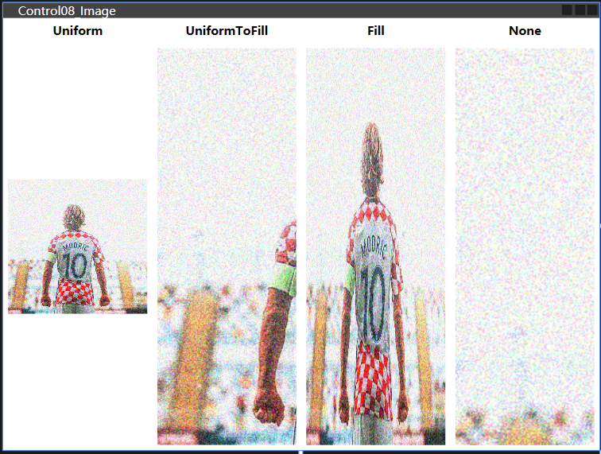
> 
> ☆：`Uniform `这是默认模式。 图片将自动缩放，以便它适合图片区域。 将保留图片的宽高比
> 
> ☆：`UniformToFill ` 图片将被缩放，以便完全填充图片区域。 将保留图片的宽高比
> 
> ☆：`Fill` 图片将缩放以适合图片控件的区域。 可能无法保留宽高比，因为图片的高度和宽度是独立缩放的
> 
> ☆：`None` 如果图片小于图片控件，则不执行任何操作。 如果它比图片控件大，则会裁剪图片以适合图片控件，这意味着只有部分图片可见

#### ToolTip

> 工具提示，信息提示或提示 - 各种名称，但保持不变：通过将鼠标悬停在上面，可以获得有关特定控件或链接的额外信息。
> 
> ```xaml
> <!-- LearnWPF\WPFJourney\LearnWPF05_Control\Control09_ToolTip -->
> <Window x:Class="LearnWPF05_Control.Control09_ToolTip"
>         xmlns="http://schemas.microsoft.com/winfx/2006/xaml/presentation"
>         xmlns:x="http://schemas.microsoft.com/winfx/2006/xaml"
>         xmlns:d="http://schemas.microsoft.com/expression/blend/2008"
>         xmlns:mc="http://schemas.openxmlformats.org/markup-compatibility/2006"
>         xmlns:local="clr-namespace:LearnWPF05_Control"
>         mc:Ignorable="d"
>         Title="Control09_ToolTip" Height="150" Width="400"
>         WindowStartupLocation="CenterScreen">
> 
>     <Grid VerticalAlignment="Center" HorizontalAlignment="Center">
>         <Button ToolTip="Click here and something will happen!" Content="click here" />
>     </Grid>
> </Window>
> ```
> 
> 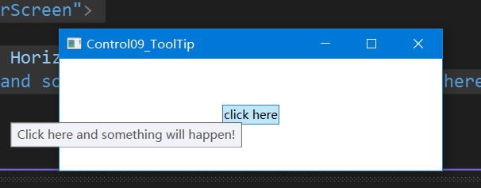
> 
> ☆：鼠标悬停在按钮上，就会产生带有字符串指定的弹出框
> 
> ---
> 
> 在 WPF 中，工具提示属性实际上不是字符串类型，类一个物件类型，表明可以在那里放任何想要的东西。提供更详细，更详细的工具提示
> 
> ```xaml
> <Window x:Class="LearnWPF05_Control.Control09_ToolTip"
>         xmlns="http://schemas.microsoft.com/winfx/2006/xaml/presentation"
>         xmlns:x="http://schemas.microsoft.com/winfx/2006/xaml"
>         xmlns:d="http://schemas.microsoft.com/expression/blend/2008"
>         xmlns:mc="http://schemas.openxmlformats.org/markup-compatibility/2006"
>         xmlns:local="clr-namespace:LearnWPF05_Control"
>         mc:Ignorable="d"
>         Title="Control09_ToolTip" Height="150" Width="400"
>         WindowStartupLocation="CenterScreen">
> 
>     <DockPanel>
>         <ToolBar DockPanel.Dock="Top" Background="Azure">
>             <Button ToolTip="Create a new file">
>                 <Button.Content>
>                     <Image Source="./Images/folder.png" Width="16" Height="16" />
>                 </Button.Content>
>             </Button>
>             <Button>
>                 <Button.Content>
>                     <Image Source="/LearnWPF05_Control;component/Images/edit.png" Width="16" Height="16" />
>                 </Button.Content>
>                 <Button.ToolTip>
>                     <StackPanel>
>                         <TextBlock FontWeight="Bold" FontSize="14" Margin="0,0,0,5">Open file</TextBlock>
>                         <TextBlock>
>                         Search your computer or local network
>                         <LineBreak />
>                         for a file and open it for editing.
>                         </TextBlock>
>                         <Border BorderBrush="Silver" BorderThickness="0,1,0,0" Margin="0,8" />
>                         <WrapPanel>
>                             <Image Source="./Images/help.png" Margin="0,0,5,0" />
>                             <TextBlock FontStyle="Italic">Press F1 for more help</TextBlock>
>                         </WrapPanel>
>                     </StackPanel>
>                 </Button.ToolTip>
>             </Button>
>         </ToolBar>
>         <TextBox>
>             Editor area...
>         </TextBox>
>     </DockPanel>
> </Window>
> ```
> 
> ---
> 
> <u>高级选项</u>
> 
> `ToolTipService` 类有一堆有趣的属性会影响提示工具的行为。可以直接在控件上设置它们有工具提示，例如像这里，使用 `ShowDuration` 属性扩展工具提示的时间（将其设置为5.000毫秒或5秒）
> 
> ```xml
> <Button ToolTip="Create a new file" ToolTipService.ShowDuration="5000" Content="Open" />
> ```
> 
> ☆：`HasDropShadow` 属性控制弹出窗口是否应该有阴影
> 
> ☆：`ShowOnDisabled` 属性决定是否应该为已禁用的控件显示提示工具
> 
> ☆：用于提高用户的体验

#### 文本渲染

> 为什么有时候 `WPF` 的文本渲染模糊不清，如何修复这个问题以及如何控制文本渲染
> 
> 相比其他 `UI`  框架，例如 `WinForms` 大量使用 `Windows API`，`WPF` 自己做了很多额外的事情。渲染文本的时候这个对比也很明显——WinForms 使用 Windows 的 `GDI API`，而 WPF 有它自己的文本渲染实现。这样就能使 WPF 更好地支持动画，也使得它不受设备依赖。
> 
> 不幸的是，这使得 WPF 渲染的文本变得有些模糊，特别是在小号字体上。这曾经是令 WPF 程序员很头疼的一个问题，但幸运的是 Microsoft 在 .NET 框架 4.0 中为 WPF 文本渲染引擎做了很多优化。这意味着如果使用 4.0 或更高的版本，文本看起来应该完美无瑕
> 
> ---
> 
> <u>控制文本渲染</u>
> 
> ```xml
> <!-- .\LearnWPF\WPFJourney\LearnWPF05_Control\Control10_TextRendering -->
> <Window x:Class="LearnWPF05_Control.Control10_TextRendering"
>         xmlns="http://schemas.microsoft.com/winfx/2006/xaml/presentation"
>         xmlns:x="http://schemas.microsoft.com/winfx/2006/xaml"
>         xmlns:d="http://schemas.microsoft.com/expression/blend/2008"
>         xmlns:mc="http://schemas.openxmlformats.org/markup-compatibility/2006"
>         xmlns:local="clr-namespace:LearnWPF05_Control"
>         mc:Ignorable="d"
>         Title="Control10_TextRendering" Height="200" Width="400"
>         WindowStartupLocation="CenterScreen">
> 
>     <StackPanel Margin="10">
>         <Label TextOptions.TextFormattingMode="Ideal" FontSize="9">TextFormattingMode.Ideal, small text</Label>
>         <Label TextOptions.TextFormattingMode="Display" FontSize="9">TextFormattingMode.Display, small text</Label>
>         <Label TextOptions.TextFormattingMode="Ideal" FontSize="20">TextFormattingMode.Ideal, large text</Label>
>         <Label TextOptions.TextFormattingMode="Display" FontSize="20">TextFormattingMode.Display, large text</Label>
>     </StackPanel>
> </Window>
> ```
> 
> ☆：`TextFormattingMode` 可以决定文本格式化所用的算法。 Ideal（默认值）或 Display。一般不需要改动这个属性，因为 Ideal 设置在大多数情况下都是最好的。但如果需要渲染非常小的文本，Display 设置有时候更好
> 
> ---
> 
> <u>TextRenderingMode</u>
> 
> ```xml
> <Window x:Class="LearnWPF05_Control.Control10_TextRendering"
>         xmlns="http://schemas.microsoft.com/winfx/2006/xaml/presentation"
>         xmlns:x="http://schemas.microsoft.com/winfx/2006/xaml"
>         xmlns:d="http://schemas.microsoft.com/expression/blend/2008"
>         xmlns:mc="http://schemas.openxmlformats.org/markup-compatibility/2006"
>         xmlns:local="clr-namespace:LearnWPF05_Control"
>         mc:Ignorable="d"
>         Title="Control10_TextRendering" Height="300" Width="400"
>         WindowStartupLocation="CenterScreen">
> 
>     <StackPanel Margin="10" TextOptions.TextFormattingMode="Display">
>         <Label TextOptions.TextRenderingMode="Auto" FontSize="9">TextRenderingMode.Auto, small text</Label>
>         <Label TextOptions.TextRenderingMode="Aliased" FontSize="9">TextRenderingMode.Aliased, small text</Label>
>         <Label TextOptions.TextRenderingMode="ClearType" FontSize="9">TextRenderingMode.ClearType, small text</Label>
>         <Label TextOptions.TextRenderingMode="Grayscale" FontSize="9">TextRenderingMode.Grayscale, small text</Label>
>         <Label TextOptions.TextRenderingMode="Auto" FontSize="18">TextRenderingMode.Auto, large text</Label>
>         <Label TextOptions.TextRenderingMode="Aliased" FontSize="18">TextRenderingMode.Aliased, large text</Label>
>         <Label TextOptions.TextRenderingMode="ClearType" FontSize="18">TextRenderingMode.ClearType, large text</Label>
>         <Label TextOptions.TextRenderingMode="Grayscale" FontSize="18">TextRenderingMode.Grayscale, large text</Label>
>     </StackPanel>
> </Window>
> ```
> 
> ☆：`TextRenderingMode` 可以控制显示文本所用的抗锯齿算法。被设为 `Display` 时，它的效果最明显

#### Tap 顺序

> `WPF` 会自动自动建立了一个从一个领域移动到另一个领域时使用的顺序。但是，有时窗口/潜在的设计会导致 WPF使用可能不同意的 Tab 键顺序，原因有多种。此外，可以决定部分控制不应该是 Tab 键顺序的具体方面
> 
> ```xml
> <Window x:Class="LearnWPF05_Control.Control11_Tab"
>         xmlns="http://schemas.microsoft.com/winfx/2006/xaml/presentation"
>         xmlns:x="http://schemas.microsoft.com/winfx/2006/xaml"
>         xmlns:d="http://schemas.microsoft.com/expression/blend/2008"
>         xmlns:mc="http://schemas.openxmlformats.org/markup-compatibility/2006"
>         xmlns:local="clr-namespace:LearnWPF05_Control"
>         mc:Ignorable="d"
>         Title="Control11_Tab" Height="250" Width="400">
>     <Grid Margin="20">
>         <Grid.ColumnDefinitions>
>             <ColumnDefinition Width="*" />
>             <ColumnDefinition Width="20" />
>             <ColumnDefinition Width="*" />
>         </Grid.ColumnDefinitions>
>         <Grid.RowDefinitions>
>             <RowDefinition Height="*" />
>             <RowDefinition Height="Auto" />
>         </Grid.RowDefinitions>
>         <StackPanel>
>             <Label>First name:</Label>
>             <TextBox TabIndex="0" />
>             <Label>Street name:</Label>
>             <TextBox TabIndex="2" />
>             <Label>City:</Label>
>             <TextBox TabIndex="5" IsReadOnly="True" IsTabStop="False" Background="Gainsboro" />
>         </StackPanel>
>         <StackPanel Grid.Column="2">
>             <Label>Last name:</Label>
>             <TextBox TabIndex="1" />
>             <Label>Zip Code:</Label>
>             <TextBox TabIndex="4" />
>         </StackPanel>
>         <Button Grid.Row="1" HorizontalAlignment="Right" Width="80">Add</Button>
>         <Button Grid.Row="1" Grid.Column="2" HorizontalAlignment="Left" Width="80">Cancel</Button>
>     </Grid>
> </Window>
> ```
> 
> ☆：`TabIndex` 用于定义顺序
> 
> ☆：`IsTabStop` 将强制WPF在窗口按Tab时跳过这个控件

#### 访问键/快捷键

> `访问键的概念`（有称为`加速键`或`键盘加速器`）允许通过按住 `Alt` 键然后按键盘上的其他键来到达窗口内的特定控件。 这增强了窗口的可用性，因为它允许用户使用键盘导航窗口，而不必使用鼠标
> 
> ---
> 
> <u>定义访问键</u>
> 
> ```xml
> <Button Content="_New"></Button>
> ```
> 
> ☆：WPF控件定义访问键通常会有一个属性，但不适用于访问键。 相反，可以通过在控件的 `Text / Content` 属性中使用添加下划线前缀来定义访问键
> 
> ---
> 
> <u>简单使用</u>
> 
> ```xml
> <Window x:Class="LearnWPF05_Control.Control12_AccessKey"
>         xmlns="http://schemas.microsoft.com/winfx/2006/xaml/presentation"
>         xmlns:x="http://schemas.microsoft.com/winfx/2006/xaml"
>         xmlns:d="http://schemas.microsoft.com/expression/blend/2008"
>         xmlns:mc="http://schemas.openxmlformats.org/markup-compatibility/2006"
>         xmlns:local="clr-namespace:LearnWPF05_Control"
>         mc:Ignorable="d"
>         Title="Control12_AccessKey" Height="200" Width="300">
> 
>     <StackPanel Margin="20">
>         <Label Content="_First name:" Target="{Binding ElementName=txtFirstName}" />
>         <TextBox Name="txtFirstName" />
>         <Label Content="_Last name:" Target="{Binding ElementName=txtLastName}" />
>         <TextBox Name="txtLastName" />
>         <Button Content="_Save" Margin="20"></Button>
>     </StackPanel>
> </Window>
> ```
> 
> ☆：按住 `Alt + F` 与 `Alt + L` 在两个 TextBox 控件中切换
> 
> ☆：按住 `Alt + S` 能够切换到Button按钮上

#### Border

> 一个装饰控件。可以用来添加一个边界，一个背景或者两者一起，以及其他的一些元素。由于 WPF 的面板(Panels)并不支持在其边缘添加边界，边界控件可以辅助实现，诸如环绕面板添加一个边界的操作
> 
> ```xml
> <!-- .\LearnWPF\WPFJourney\LearnWPF05_Control\Control12_Border -->
> <Window x:Class="LearnWPF05_Control.Control13_Border"
>         xmlns="http://schemas.microsoft.com/winfx/2006/xaml/presentation"
>         xmlns:x="http://schemas.microsoft.com/winfx/2006/xaml"
>         xmlns:d="http://schemas.microsoft.com/expression/blend/2008"
>         xmlns:mc="http://schemas.openxmlformats.org/markup-compatibility/2006"
>         xmlns:local="clr-namespace:LearnWPF05_Control"
>         mc:Ignorable="d"
>         Title="Control13_Border" Height="170" Width="200">
>     <Grid Margin="10">
>         <Border Background="GhostWhite" BorderBrush="Gainsboro" BorderThickness="1">
>             <StackPanel Margin="10">
>                 <Button>Button 1</Button>
>                 <Button Margin="0,10">Button 2</Button>
>                 <Button>Button 3</Button>
>             </StackPanel>
>         </Border>
>     </Grid>
> </Window>
> ```
> 
> 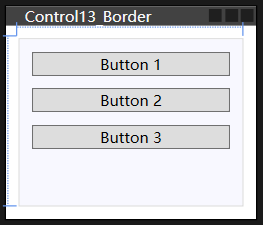
> 
> ---
> 
> <u>圆角边界</u>
> 
> ```xml
> <Window x:Class="LearnWPF05_Control.Control13_Border"
>         xmlns="http://schemas.microsoft.com/winfx/2006/xaml/presentation"
>         xmlns:x="http://schemas.microsoft.com/winfx/2006/xaml"
>         xmlns:d="http://schemas.microsoft.com/expression/blend/2008"
>         xmlns:mc="http://schemas.openxmlformats.org/markup-compatibility/2006"
>         xmlns:local="clr-namespace:LearnWPF05_Control"
>         mc:Ignorable="d"
>         Title="Control13_Border" Height="170" Width="200">
>     <Grid Margin="10">
>         <!--#region 圆角边界 -->
>         <Border Background="GhostWhite" BorderBrush="Silver" BorderThickness="1" CornerRadius="8,8,3,3">
>             <StackPanel Margin="10">
>                 <Button>Button 1</Button>
>                 <Button Margin="0,10">Button 2</Button>
>                 <Button>Button 3</Button>
>             </StackPanel>
>         </Border>
>         <!--#endregion-->
> 
>     </Grid>
> </Window>
> ```
> 
> 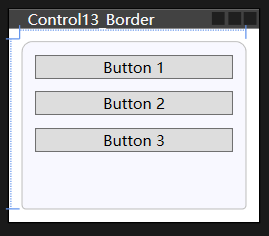
> 
> ---
> 
> <u>边界颜色/宽度</u>
> 
> ```xml
> <Window x:Class="LearnWPF05_Control.Control13_Border"
>         xmlns="http://schemas.microsoft.com/winfx/2006/xaml/presentation"
>         xmlns:x="http://schemas.microsoft.com/winfx/2006/xaml"
>         xmlns:d="http://schemas.microsoft.com/expression/blend/2008"
>         xmlns:mc="http://schemas.openxmlformats.org/markup-compatibility/2006"
>         xmlns:local="clr-namespace:LearnWPF05_Control"
>         mc:Ignorable="d"
>         Title="Control13_Border" Height="170" Width="200">
>     <Grid Margin="10">
>         <!--#region 边界颜色 -->
>         <Border Background="GhostWhite" BorderBrush="DodgerBlue" BorderThickness="1,3,1,5">
>             <StackPanel Margin="10">
>                 <Button>Button 1</Button>
>                 <Button Margin="0,10">Button 2</Button>
>                 <Button>Button 3</Button>
>             </StackPanel>
>         </Border>
>         <!--#endregion-->
>     </Grid>
> </Window>
> ```
> 
> 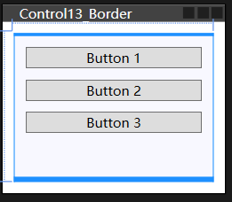
> 
> ---
> 
> <u>边界背景</u>
> 
> ```xml
> <Window x:Class="LearnWPF05_Control.Control13_Border"
>         xmlns="http://schemas.microsoft.com/winfx/2006/xaml/presentation"
>         xmlns:x="http://schemas.microsoft.com/winfx/2006/xaml"
>         xmlns:d="http://schemas.microsoft.com/expression/blend/2008"
>         xmlns:mc="http://schemas.openxmlformats.org/markup-compatibility/2006"
>         xmlns:local="clr-namespace:LearnWPF05_Control"
>         mc:Ignorable="d"
>         Title="Control13_Border" Height="170" Width="200">
>     <Grid Margin="10">
>         <!--#region 边界背景 -->
>         <Border BorderBrush="Navy" BorderThickness="1,3,1,5">
>             <Border.Background>
>                 <LinearGradientBrush StartPoint="0.5,0" EndPoint="0.5,1">
>                     <GradientStop Color="LightCyan" Offset="0.0" />
>                     <GradientStop Color="LightBlue" Offset="0.5" />
>                     <GradientStop Color="DarkTurquoise" Offset="1.0" />
>                 </LinearGradientBrush>
>             </Border.Background>
>             <StackPanel Margin="10">
>                 <Button>Button 1</Button>
>                 <Button Margin="0,10">Button 2</Button>
>                 <Button>Button 3</Button>
>             </StackPanel>
>         </Border>
>         <!--#endregion-->
>     </Grid>
> </Window>
> ```
> 
> 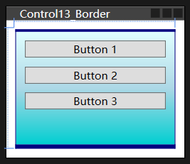

#### Slider

> 允许通过沿水平或垂直线拖动滑块(Thumb)来选择数值
> 
> ```xml
> <Window x:Class="LearnWPF05_Control.Control14_Slider"
>         xmlns="http://schemas.microsoft.com/winfx/2006/xaml/presentation"
>         xmlns:x="http://schemas.microsoft.com/winfx/2006/xaml"
>         xmlns:d="http://schemas.microsoft.com/expression/blend/2008"
>         xmlns:mc="http://schemas.openxmlformats.org/markup-compatibility/2006"
>         xmlns:local="clr-namespace:LearnWPF05_Control"
>         mc:Ignorable="d"
>         Title="Control14_Slider" Height="100" Width="300">
>     <StackPanel VerticalAlignment="Center" Margin="10">
>         <Slider Maximum="100" />
>     </StackPanel>
> </Window>
> ```
> 
> ---
> 
> <u>刻度</u>
> 
> ```xml
> <Window x:Class="LearnWPF05_Control.Control14_Slider"
>         xmlns="http://schemas.microsoft.com/winfx/2006/xaml/presentation"
>         xmlns:x="http://schemas.microsoft.com/winfx/2006/xaml"
>         xmlns:d="http://schemas.microsoft.com/expression/blend/2008"
>         xmlns:mc="http://schemas.openxmlformats.org/markup-compatibility/2006"
>         xmlns:local="clr-namespace:LearnWPF05_Control"
>         mc:Ignorable="d"
>         Title="Control14_Slider" Height="100" Width="300">
> 
>     <!--#region Slider刻度-->
>     <StackPanel VerticalAlignment="Center" Margin="10">
>         <Slider Maximum="100" TickPlacement="BottomRight" TickFrequency="5" />
>     </StackPanel>
>     <!--#endregion-->
> </Window>
> ```
> 
> 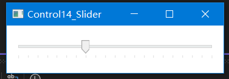
> 
> ---
> 
> <u>捕获标记</u>
> 

### 面板（布局）控件

#### Canvas控件
